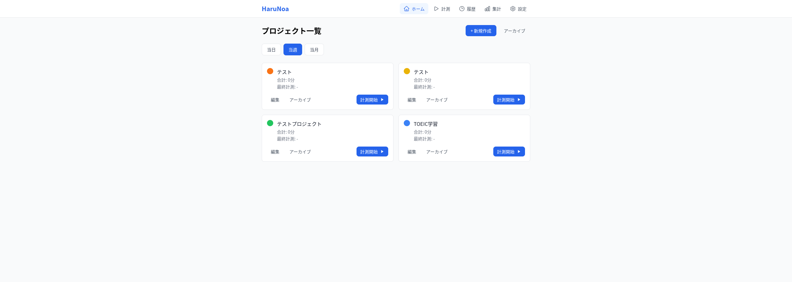
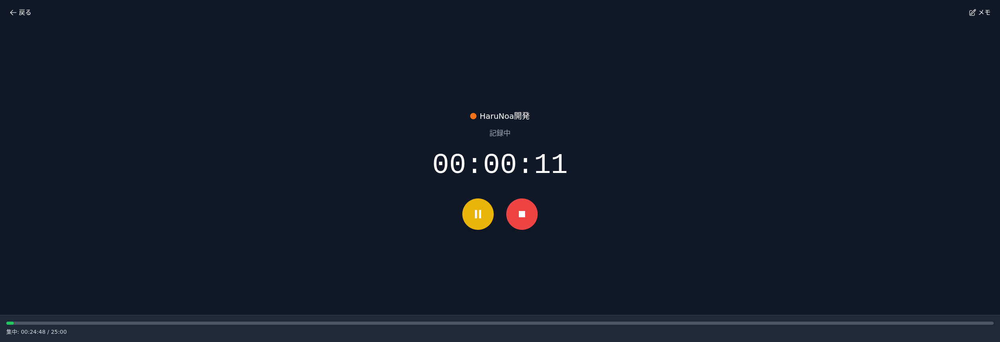
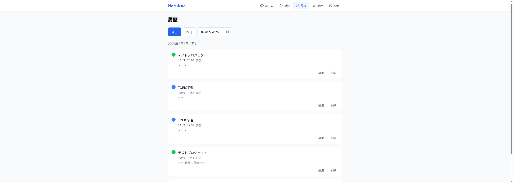

# HaruNoa


作業時間をプロジェクト単位で記録・可視化するWebアプリケーション

## 概要

HaruNoaは、日々の作業を「プロジェクト単位」で記録し、進捗を可視化するためのタイムトラッキングアプリです。
Googleアカウントでログインするだけで、すぐに作業時間の計測を始められます。

## スクリーンショット

| プロジェクト一覧 | 集中モード（タイマー + ポモドーロ） | 作業履歴 |
|:---:|:---:|:---:|
|  |  |  |

## 主な機能

- **タイマー機能** — ワンクリックで作業時間を計測。一時停止・再開にも対応
- **プロジェクト管理** — 複数プロジェクトをカラーラベル付きで管理し、作業時間を個別に集計
- **集中モード** — ダークテーマの全画面UIで作業に没頭できる環境を提供
- **ポモドーロタイマー** — 作業と休憩のサイクルを自動管理。プリセットのカスタマイズも可能
- **履歴・分析** — 作業履歴の検索・編集と、棒グラフ・円グラフによる可視化
- **オフライン対応** — オフライン時もタイマー操作が可能。復帰時にデータを自動同期
- **通知** — タイマー終了・ポモドーロフェーズ切り替え時にブラウザ通知とサウンドで通知
- **セッションアーカイブ** — 古いセッションを自動アーカイブし、データベースの肥大化を防止
- **Googleログイン** — Firebase Authによるワンクリック認証
- **レスポンシブ対応** — モバイル・タブレット・デスクトップすべてに最適化

## 技術スタック

| カテゴリ | 技術 |
|----------|------|
| Framework | Next.js 14 (App Router) |
| Language | TypeScript |
| Styling | Tailwind CSS |
| Auth | Google Auth (Firebase Auth) |
| Database | Firestore |
| State | Zustand |
| Form | React Hook Form + Zod |
| Chart | Chart.js |
| Test | Vitest + Testing Library |

## アーキテクチャ

```
ブラウザ
├── UI層 (React Components)
│   └── カスタムHooks (useTimer, usePomodoro, useProjects, ...)
│       ├── Zustand Stores (状態管理 + localStorage永続化)
│       └── Services層 (Firebase SDK ラッパー)
│           └── Firebase (Auth / Firestore)
└── オフラインキュー
    └── 復帰時に自動同期
```

- **Services層**: Firebase SDKの直接呼び出しをカプセル化し、UIコンポーネントから分離
- **状態管理**: Zustand + persist middleware でタイマー状態・ポモドーロ状態をlocalStorageに永続化
- **オフラインキュー**: ネットワーク切断中の操作をキューに蓄積し、復帰時にバッチ同期

## 開発セットアップ

### 必要条件

- Node.js 18以上
- npm 9以上
- Firebaseプロジェクト

### インストール

```bash
# リポジトリをクローン
git clone https://github.com/HiroTech08/harunoa-prototype.git
cd harunoa-prototype

# 依存関係をインストール
npm install
```

### 環境変数の設定

`.env.example` をコピーして `.env.local` を作成し、Firebase の設定値を入力してください。

```bash
cp .env.example .env.local
```

```env
NEXT_PUBLIC_FIREBASE_API_KEY=your-api-key
NEXT_PUBLIC_FIREBASE_AUTH_DOMAIN=your-project.firebaseapp.com
NEXT_PUBLIC_FIREBASE_PROJECT_ID=your-project-id
NEXT_PUBLIC_FIREBASE_STORAGE_BUCKET=your-project.appspot.com
NEXT_PUBLIC_FIREBASE_MESSAGING_SENDER_ID=your-sender-id
NEXT_PUBLIC_FIREBASE_APP_ID=your-app-id
NEXT_PUBLIC_APP_URL=http://localhost:3000
```

### 開発サーバーの起動

```bash
npm run dev
```

http://localhost:3000 でアプリケーションにアクセスできます。

## 開発コマンド

| コマンド | 説明 |
|----------|------|
| `npm run dev` | 開発サーバーを起動 |
| `npm run build` | 本番用ビルド |
| `npm run start` | 本番サーバーを起動 |
| `npm run lint` | ESLintでコードチェック |
| `npm run test` | テストを監視モードで実行 |
| `npm run test:run` | テストを1回実行 |

## ディレクトリ構造

```
src/
├── app/            # ページ（App Router）
│   ├── login/      #   ログイン
│   └── (auth)/     #   認証必須ページ
│       ├── page.tsx        # ホーム（プロジェクト一覧）
│       ├── timer/          # タイマー
│       ├── focus/          # 集中モード
│       ├── history/        # 履歴
│       ├── analytics/      # 集計
│       ├── presets/        # プリセット管理
│       ├── settings/       # 設定
│       └── archive/        # アーカイブ
├── components/     # UIコンポーネント
│   ├── ui/         #   汎用UI（Button, Modal, Toast等）
│   ├── features/   #   機能別コンポーネント
│   └── layout/     #   レイアウト（Header等）
├── hooks/          # カスタムフック
├── lib/            # ユーティリティ・設定
├── services/       # Firebase/外部サービス連携
├── stores/         # Zustandストア
└── types/          # 型定義
```

## ドキュメント

開発に関する詳細は以下のドキュメントを参照してください。

| ドキュメント | 説明 |
|--------------|------|
| [`docs/requirements.md`](./docs/requirements.md) | 要件定義 |
| [`docs/screen_specifications/`](./docs/screen_specifications/) | 画面仕様書 |
| [`docs/implementation/`](./docs/implementation/) | 実装指示書 |
| [`docs/testing/`](./docs/testing/) | テスト仕様書 |
| [`docs/01_tech-stack.md`](./docs/01_tech-stack.md) | 技術スタック詳細 |
| [`docs/02_data-model.md`](./docs/02_data-model.md) | データモデル設計 |
| [`docs/03_api-design.md`](./docs/03_api-design.md) | API設計 |
| [`docs/04_component-structure.md`](./docs/04_component-structure.md) | コンポーネント構成 |

## ステータス

v0.1.0 — 全機能実装完了・システムテスト済み
