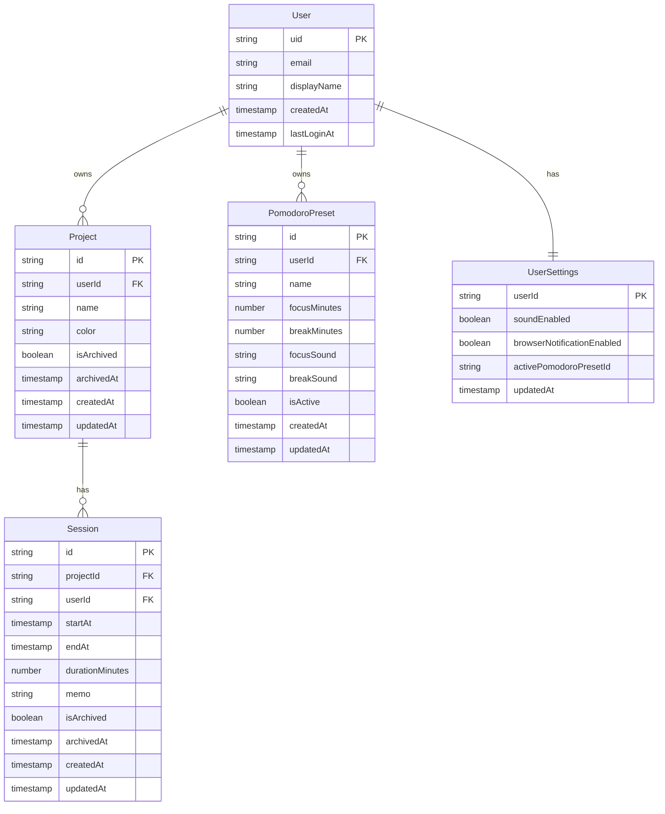

# データモデル設計書（HaruNoa）

作成日：2026-01-22
関連ドキュメント：requirements.md, 01_tech-stack.md

---

## 1. 概要

本ドキュメントは、HaruNoaのデータモデルを定義する。
Cloud Firestoreを使用したNoSQLデータ構造を採用する。

---

## 2. ER図



---

## 3. Firestoreコレクション構造

```
firestore/
├── users/{userId}
│   ├── email: string
│   ├── displayName: string
│   ├── createdAt: timestamp
│   └── lastLoginAt: timestamp
│
├── projects/{projectId}
│   ├── userId: string
│   ├── name: string
│   ├── color: string
│   ├── isArchived: boolean
│   ├── archivedAt: timestamp | null
│   ├── createdAt: timestamp
│   └── updatedAt: timestamp
│
├── sessions/{sessionId}
│   ├── projectId: string
│   ├── userId: string
│   ├── startAt: timestamp
│   ├── endAt: timestamp
│   ├── durationMinutes: number
│   ├── memo: string
│   ├── isArchived: boolean
│   ├── archivedAt: timestamp | null
│   ├── createdAt: timestamp
│   └── updatedAt: timestamp
│
├── pomodoroPresets/{presetId}
│   ├── userId: string
│   ├── name: string
│   ├── focusMinutes: number
│   ├── breakMinutes: number
│   ├── focusSound: string
│   ├── breakSound: string
│   ├── isActive: boolean
│   ├── createdAt: timestamp
│   └── updatedAt: timestamp
│
└── userSettings/{userId}
    ├── soundEnabled: boolean
    ├── browserNotificationEnabled: boolean
    ├── activePomodoroPresetId: string | null
    └── updatedAt: timestamp
```

---

## 4. TypeScript型定義

```typescript
// types/user.ts
export interface User {
  uid: string;
  email: string;
  displayName: string;
  createdAt: Date;
  lastLoginAt: Date;
}

// types/project.ts
export interface Project {
  id: string;
  userId: string;
  name: string;
  color: string;
  isArchived: boolean;
  archivedAt: Date | null;
  createdAt: Date;
  updatedAt: Date;
}

export type CreateProjectInput = Pick<Project, 'name' | 'color'>;
export type UpdateProjectInput = Partial<Pick<Project, 'name' | 'color'>>;

// types/session.ts
export interface Session {
  id: string;
  projectId: string;
  userId: string;
  startAt: Date;
  endAt: Date;
  durationMinutes: number;
  memo: string;
  isArchived: boolean;
  archivedAt: Date | null;
  createdAt: Date;
  updatedAt: Date;
}

export type CreateSessionInput = Pick<Session, 'projectId' | 'startAt' | 'endAt' | 'memo'>;
export type UpdateSessionInput = Partial<Pick<Session, 'startAt' | 'endAt' | 'memo'>>;

// types/preset.ts
export type NotificationSound = 'none' | 'bell' | 'chime' | 'ding';

export interface PomodoroPreset {
  id: string;
  userId: string;
  name: string;
  focusMinutes: number;   // 25分以上
  breakMinutes: number;   // 5〜10分
  focusSound: NotificationSound;
  breakSound: NotificationSound;
  isActive: boolean;
  createdAt: Date;
  updatedAt: Date;
}

export type CreatePresetInput = Pick<
  PomodoroPreset, 
  'name' | 'focusMinutes' | 'breakMinutes' | 'focusSound' | 'breakSound'
>;

// types/settings.ts
export interface UserSettings {
  userId: string;
  soundEnabled: boolean;
  browserNotificationEnabled: boolean;
  activePomodoroPresetId: string | null;
  updatedAt: Date;
}
```

---

## 5. カラーパレット（24色）

プロジェクト色の自動割当・手動選択に使用する定義済みカラー：

```typescript
// constants/colors.ts
export const PROJECT_COLORS = [
  '#3B82F6', // blue
  '#22C55E', // green
  '#EAB308', // yellow
  '#F97316', // orange
  '#EF4444', // red
  '#A855F7', // purple
  '#78716C', // brown
  '#1F2937', // gray-dark
  '#9CA3AF', // gray-light
  '#06B6D4', // cyan
  '#EC4899', // pink
  '#84CC16', // lime
  '#6366F1', // indigo
  '#14B8A6', // teal
  '#F59E0B', // amber
  '#F43F5E', // rose
  '#0EA5E9', // sky
  '#9F1239', // wine
  '#10B981', // emerald
  '#6B21A8', // purple-dark
  '#B45309', // bronze
  '#D946EF', // fuchsia
  '#1E3A8A', // navy
  '#15803D', // green-dark
] as const;

export type ProjectColor = typeof PROJECT_COLORS[number];
```

保存済みプロジェクトの色がパレット外にならないよう、定義済みの色の削除・変更は行わない。
自動割当はこの配列順に走査するため、隣接する色が判別しやすい並びを維持する。

---

## 6. インデックス設計

```javascript
// Firestore複合インデックス
// firestore.indexes.json

{
  "indexes": [
    {
      "collectionGroup": "projects",
      "queryScope": "COLLECTION",
      "fields": [
        { "fieldPath": "userId", "order": "ASCENDING" },
        { "fieldPath": "isArchived", "order": "ASCENDING" },
        { "fieldPath": "updatedAt", "order": "DESCENDING" }
      ]
    },
    {
      "collectionGroup": "sessions",
      "queryScope": "COLLECTION",
      "fields": [
        { "fieldPath": "userId", "order": "ASCENDING" },
        { "fieldPath": "startAt", "order": "DESCENDING" }
      ]
    },
    {
      "collectionGroup": "sessions",
      "queryScope": "COLLECTION",
      "fields": [
        { "fieldPath": "userId", "order": "ASCENDING" },
        { "fieldPath": "isArchived", "order": "ASCENDING" },
        { "fieldPath": "startAt", "order": "DESCENDING" }
      ]
    },
    {
      "collectionGroup": "sessions",
      "queryScope": "COLLECTION",
      "fields": [
        { "fieldPath": "userId", "order": "ASCENDING" },
        { "fieldPath": "isArchived", "order": "ASCENDING" },
        { "fieldPath": "endAt", "order": "ASCENDING" }
      ]
    },
    {
      "collectionGroup": "sessions",
      "queryScope": "COLLECTION",
      "fields": [
        { "fieldPath": "projectId", "order": "ASCENDING" },
        { "fieldPath": "startAt", "order": "DESCENDING" }
      ]
    }
  ]
}
```

---

## 7. セキュリティルール

```javascript
// firestore.rules
rules_version = '2';
service cloud.firestore {
  match /databases/{database}/documents {
    // 認証済みユーザーのみ
    function isAuthenticated() {
      return request.auth != null;
    }
    
    // 自分のデータのみアクセス可能
    function isOwner(userId) {
      return request.auth.uid == userId;
    }
    
    match /users/{userId} {
      allow read, write: if isAuthenticated() && isOwner(userId);
    }
    
    match /projects/{projectId} {
      allow read, write: if isAuthenticated() 
        && isOwner(resource.data.userId);
      allow create: if isAuthenticated() 
        && isOwner(request.resource.data.userId);
    }
    
    match /sessions/{sessionId} {
      allow read, write: if isAuthenticated() 
        && isOwner(resource.data.userId);
      allow create: if isAuthenticated() 
        && isOwner(request.resource.data.userId);
    }
    
    match /pomodoroPresets/{presetId} {
      allow read, write: if isAuthenticated() 
        && isOwner(resource.data.userId);
      allow create: if isAuthenticated() 
        && isOwner(request.resource.data.userId);
    }
    
    match /userSettings/{userId} {
      allow read, write: if isAuthenticated() && isOwner(userId);
    }
  }
}
```

---

## 8. 変更履歴

| バージョン | 日付 | 変更内容 |
|------------|------|----------|
| v0 | 2026-01-22 | 初版作成 |
| v1 | 2026-01-23 | ディレクトリ構造変更に伴う修正 |
| v2 | 2026-01-23 | セッションアーカイブ機能対応 |

### v2での主な変更点

| カテゴリ | 変更内容 |
|----------|----------|
| Session型 | `isArchived`, `archivedAt` フィールドを追加 |
| Firestore構造 | sessionsコレクションに `isArchived`, `archivedAt` を追加 |
| インデックス | アーカイブ状態でのフィルタリング用インデックスを追加 |

### v1での主な変更点

| カテゴリ | 変更内容 |
|----------|----------|
| 関連ドキュメント | 01_tech-stack.md を追加 |
| カラーパレット | パスを `lib/constants/colors.ts` → `constants/colors.ts` に変更 |
| 型定義 | ファイル名を `types/pomodoro.ts` → `types/preset.ts` に変更 |
