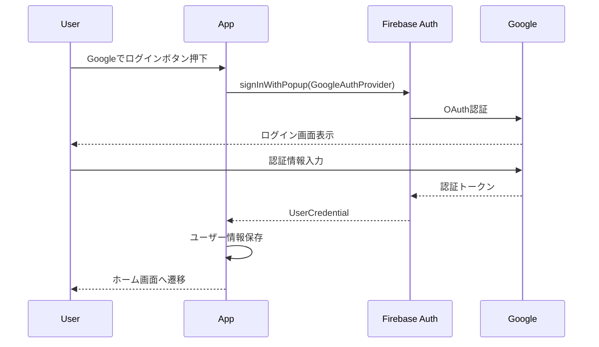

# API設計書（HaruNoa）

作成日：2026-01-22
関連ドキュメント：requirements.md, 02_data-model.md, 01_tech-stack.md

---

## 1. 概要

本ドキュメントは、HaruNoaのAPI設計を定義する。
Firebase SDKを使用したクライアントサイド直接アクセスを基本とする。

### 1.1 レイヤー構造

```
┌─────────────────────────────────────────────────────────────┐
│  hooks/                   UIからの呼び出し口                   │
├─────────────────────────────────────────────────────────────┤
│  services/                データアクセス層（本ドキュメントの対象）│
├─────────────────────────────────────────────────────────────┤
│  lib/firebase/            Firebase初期化・インスタンス          │
│  lib/date/                日付操作・集計ロジック                │
└─────────────────────────────────────────────────────────────┘
```

### 1.2 ファイル配置

| ディレクトリ | 責任 | 例 |
|-------------|------|-----|
| `services/` | Firebase SDKを使用したCRUD操作 | `services/projects.ts` |
| `lib/firebase/` | Firebaseインスタンスの初期化のみ | `lib/firebase/config.ts` |
| `lib/date/` | 純粋な日付計算・集計ロジック | `lib/date/aggregation.ts` |

---

## 2. 認証

### 2.1 Google認証フロー



### 2.2 認証関連API

```typescript
// services/auth.ts

// ログイン
async function signInWithGoogle(): Promise<User>

// ログアウト
async function signOut(): Promise<void>

// 認証状態監視
function onAuthStateChanged(callback: (user: User | null) => void): Unsubscribe
```

---

## 3. プロジェクトAPI

### 3.1 概要

| 操作 | 関数名 | 説明 |
|------|--------|------|
| 作成 | `createProject` | 新規プロジェクト作成 |
| 一覧取得 | `getProjects` | アクティブなプロジェクト一覧 |
| 更新 | `updateProject` | プロジェクト情報更新 |
| アーカイブ | `archiveProject` | プロジェクトをアーカイブ |
| 復帰 | `restoreProject` | アーカイブから復帰 |
| アーカイブ一覧 | `getArchivedProjects` | アーカイブ済み一覧 |

### 3.2 詳細

```typescript
// services/projects.ts

// 作成
async function createProject(userId: string, input: CreateProjectInput): Promise<Project>
// input: { name: string, color?: string }
// 色が未指定の場合は自動割当

// 一覧取得（アクティブのみ）
async function getProjects(userId: string): Promise<Project[]>
// isArchived === false のものを取得
// updatedAt降順でソート

// 更新
async function updateProject(id: string, input: UpdateProjectInput): Promise<void>
// input: { name?: string, color?: string }

// アーカイブ
async function archiveProject(id: string): Promise<void>
// isArchived = true, archivedAt = now

// 復帰
async function restoreProject(id: string): Promise<void>
// isArchived = false, archivedAt = null

// アーカイブ一覧
async function getArchivedProjects(userId: string): Promise<Project[]>
// isArchived === true のものを取得
```

---

## 4. セッションAPI

### 4.1 概要

| 操作 | 関数名 | 説明 |
|------|--------|------|
| 作成 | `createSession` | セッション記録 |
| 更新 | `updateSession` | セッション修正 |
| 削除 | `deleteSession` | セッション削除 |
| 日付別取得 | `getSessionsByDate` | 指定日のセッション（アクティブのみ） |
| 期間別取得 | `getSessionsByPeriod` | 期間内のセッション（アクティブのみ） |
| アーカイブ実行 | `archiveOldSessions` | 1年以上経過したセッションをアーカイブ |
| アーカイブ済み取得 | `getArchivedSessions` | アーカイブ済みセッション一覧 |

### 4.2 詳細

```typescript
// services/sessions.ts

// 作成
async function createSession(userId: string, input: CreateSessionInput): Promise<Session>
// input: { projectId, startAt, endAt, memo? }
// durationMinutesは自動計算

// 更新
async function updateSession(id: string, input: UpdateSessionInput): Promise<void>
// input: { startAt?, endAt?, memo? }
// durationMinutesを再計算

// 削除
async function deleteSession(id: string): Promise<void>

// 日付別取得（ページネーション対応）
async function getSessionsByDate(
  userId: string,
  date: Date,
  options?: { limit: number, cursor?: string }
): Promise<{ sessions: Session[], nextCursor?: string }>
// 1ページ50件
// startAt降順でソート

// 期間別取得（集計用、アクティブのみ）
async function getSessionsByPeriod(
  userId: string,
  startDate: Date,
  endDate: Date,
  projectId?: string
): Promise<Session[]>
// isArchived === false のものを取得

// 1年以上経過したセッションをアーカイブ
async function archiveOldSessions(userId: string): Promise<{ archivedCount: number }>
// endAtが現在から1年以上前のセッションを対象
// isArchived = true, archivedAt = now に更新
// アーカイブした件数を返却

// アーカイブ済みセッション一覧（CSVエクスポート用）
async function getArchivedSessions(userId: string): Promise<Session[]>
// isArchived === true のものを取得
// startAt降順でソート
```

---

## 5. ポモドーロプリセットAPI

### 5.1 概要

| 操作 | 関数名 | 説明 |
|------|--------|------|
| 作成 | `createPreset` | プリセット作成 |
| 一覧取得 | `getPresets` | プリセット一覧 |
| 更新 | `updatePreset` | プリセット更新 |
| 削除 | `deletePreset` | プリセット削除 |
| アクティブ設定 | `setActivePreset` | 利用中に設定 |

### 5.2 詳細

```typescript
// services/presets.ts

// 作成
async function createPreset(userId: string, input: CreatePresetInput): Promise<PomodoroPreset>
// input: { name, focusMinutes, breakMinutes, focusSound, breakSound }

// 一覧取得
async function getPresets(userId: string): Promise<PomodoroPreset[]>
// createdAt昇順でソート

// 更新
async function updatePreset(id: string, input: Partial<CreatePresetInput>): Promise<void>

// 削除
async function deletePreset(id: string): Promise<void>
// アクティブなプリセットは削除不可

// アクティブ設定
async function setActivePreset(userId: string, presetId: string): Promise<void>
// 他のプリセットのisActiveをfalseに
```

---

## 6. 設定API

```typescript
// services/settings.ts

// 取得
async function getUserSettings(userId: string): Promise<UserSettings>

// 更新
async function updateUserSettings(userId: string, input: Partial<UserSettings>): Promise<void>
```

---

## 7. 集計API

### 7.1 概要

```typescript
// lib/date/aggregation.ts

// 日別集計
function aggregateByDay(sessions: Session[]): DayAggregate[]

// 週別集計
function aggregateByWeek(sessions: Session[], weekStartDay: 'monday'): WeekAggregate[]

// 月別集計
function aggregateByMonth(sessions: Session[]): MonthAggregate[]

// 年別集計
function aggregateByYear(sessions: Session[]): YearAggregate[]

// プロジェクト別集計
function aggregateByProject(sessions: Session[]): ProjectAggregate[]
```

### 7.2 型定義

```typescript
interface AggregateItem {
  projectId: string;
  projectName: string;
  projectColor: string;
  totalMinutes: number;
  percentage: number;
}

interface DayAggregate {
  date: Date;
  items: AggregateItem[];
  totalMinutes: number;
}

interface WeekAggregate {
  weekStart: Date;
  weekEnd: Date;
  items: AggregateItem[];
  totalMinutes: number;
}
```

---

## 8. 日付跨ぎの按分ロジック

```typescript
// lib/date/session-split.ts

interface SplitSession {
  date: Date;
  minutes: number;
}

// セッションを日付ごとに分割
function splitSessionByDate(session: Session): SplitSession[]

// 例：
// startAt: 2026-01-21 23:50
// endAt:   2026-01-22 00:10
// 結果: [
//   { date: 2026-01-21, minutes: 10 },
//   { date: 2026-01-22, minutes: 10 }
// ]
```

---

## 9. エラーハンドリング

### 9.1 エラーコード

```typescript
// lib/errors.ts

export enum ErrorCode {
  // 認証
  AUTH_FAILED = 'AUTH_FAILED',
  UNAUTHORIZED = 'UNAUTHORIZED',
  
  // バリデーション
  VALIDATION_ERROR = 'VALIDATION_ERROR',
  
  // 操作
  NOT_FOUND = 'NOT_FOUND',
  ALREADY_EXISTS = 'ALREADY_EXISTS',
  CANNOT_DELETE_ACTIVE = 'CANNOT_DELETE_ACTIVE',
  
  // 通信
  NETWORK_ERROR = 'NETWORK_ERROR',
  TIMEOUT = 'TIMEOUT',
}

export class AppError extends Error {
  constructor(
    public code: ErrorCode,
    message: string,
    public details?: Record<string, unknown>
  ) {
    super(message);
  }
}
```

### 9.2 リトライ処理

```typescript
// lib/retry.ts

async function withRetry<T>(
  fn: () => Promise<T>,
  options?: { maxRetries: number, delayMs: number }
): Promise<T>
// デフォルト: 3回リトライ、1秒間隔
```

---

## 10. ファイル配置まとめ

| ファイル | 責任 |
|----------|------|
| `services/auth.ts` | 認証（signIn, signOut, 状態監視） |
| `services/projects.ts` | プロジェクトCRUD |
| `services/sessions.ts` | セッションCRUD |
| `services/presets.ts` | プリセットCRUD |
| `services/settings.ts` | ユーザー設定 |
| `lib/date/aggregation.ts` | 集計ロジック |
| `lib/date/session-split.ts` | 按分ロジック |
| `lib/errors.ts` | エラーコード定義 |
| `lib/retry.ts` | リトライ処理 |

---

## 11. 変更履歴

| バージョン | 日付 | 変更内容 |
|------------|------|----------|
| v0 | 2026-01-22 | 初版作成 |
| v1 | 2026-01-23 | services/レイヤー導入に伴うファイル配置の変更 |
| v2 | 2026-01-23 | 関数シグネチャにuserIdパラメータを追加（実装仕様書との整合性） |
| v3 | 2026-01-23 | セッションアーカイブAPI追加 |

### v3での主な変更点

| カテゴリ | 変更内容 |
|----------|----------|
| セッションAPI | `archiveOldSessions`, `getArchivedSessions` を追加 |
| セッションAPI | `getSessionsByDate`, `getSessionsByPeriod` がアクティブのみ取得することを明記 |

### v2での主な変更点

| カテゴリ | 変更内容 |
|----------|----------|
| プロジェクトAPI | `createProject`, `getProjects`, `getArchivedProjects` にuserIdを追加 |
| セッションAPI | `createSession`, `getSessionsByDate`, `getSessionsByPeriod` にuserIdを追加 |
| プリセットAPI | `createPreset`, `getPresets`, `setActivePreset` にuserIdを追加 |
| 設定API | `getUserSettings`, `updateUserSettings` にuserIdを追加 |

### v1での主な変更点

| カテゴリ | 変更内容 |
|----------|----------|
| 構造変更 | `lib/firebase/*` → `services/*` に移行 |
| 構造変更 | `lib/utils/aggregation.ts` → `lib/date/aggregation.ts` に移行 |
| 構造変更 | `lib/utils/session-split.ts` → `lib/date/session-split.ts` に移行 |
| 構造変更 | `lib/utils/retry.ts` → `lib/retry.ts` に移行 |
| ドキュメント | レイヤー構造とファイル配置まとめを追加 |
