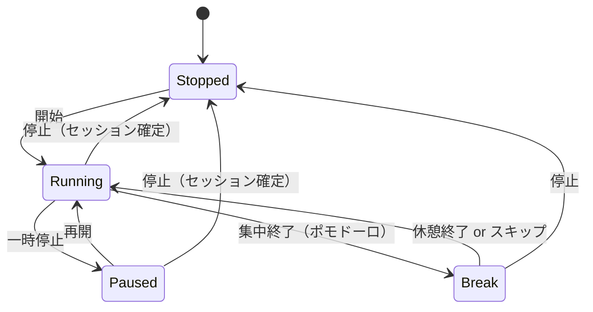

# タイマー・集中モード 実装指示書

対象画面：SCR-004（計測）、SCR-005（集中モード）
関連ドキュメント：screen_specifications.md 6.4〜6.5節

---

## 概要

作業時間の計測機能と集中モードを実装する。
ポモドーロとの連携、離脱確認ダイアログを含む。

---

## 前提条件

- `02_project-management.md`が完了していること

---

## 状態遷移図



---

## 実装手順

### 1. タイマーストア

`src/stores/timerStore.ts`:
```typescript
import { create } from 'zustand';
import { persist } from 'zustand/middleware';

type TimerStatus = 'stopped' | 'running' | 'paused';

interface TimerState {
  status: TimerStatus;
  projectId: string | null;
  projectName: string | null;
  projectColor: string | null;
  startAt: number | null;      // Unix timestamp
  pausedAt: number | null;
  totalPausedMs: number;
  memo: string;
}

interface TimerActions {
  start: (project: { id: string; name: string; color: string }) => void;
  pause: () => void;
  resume: () => void;
  stop: () => { projectId: string; startAt: Date; endAt: Date; memo: string } | null;
  setMemo: (memo: string) => void;
  reset: () => void;
}

const initialState: TimerState = {
  status: 'stopped',
  projectId: null,
  projectName: null,
  projectColor: null,
  startAt: null,
  pausedAt: null,
  totalPausedMs: 0,
  memo: '',
};

export const useTimerStore = create<TimerState & TimerActions>()(
  persist(
    (set, get) => ({
      ...initialState,

      start: (project) => {
        set({
          status: 'running',
          projectId: project.id,
          projectName: project.name,
          projectColor: project.color,
          startAt: Date.now(),
          pausedAt: null,
          totalPausedMs: 0,
          memo: '',
        });
      },

      pause: () => {
        set({ status: 'paused', pausedAt: Date.now() });
      },

      resume: () => {
        const { pausedAt, totalPausedMs } = get();
        if (pausedAt) {
          set({
            status: 'running',
            pausedAt: null,
            totalPausedMs: totalPausedMs + (Date.now() - pausedAt),
          });
        }
      },

      stop: () => {
        const { projectId, startAt, memo, pausedAt, totalPausedMs, status } = get();
        if (!projectId || !startAt) return null;

        let finalPausedMs = totalPausedMs;
        if (status === 'paused' && pausedAt) {
          finalPausedMs += Date.now() - pausedAt;
        }

        const result = {
          projectId,
          startAt: new Date(startAt),
          endAt: new Date(Date.now() - finalPausedMs + startAt),
          memo,
        };

        set(initialState);
        return result;
      },

      setMemo: (memo) => set({ memo }),
      reset: () => set(initialState),
    }),
    {
      name: 'harunoa-timer',
    }
  )
);
```

### 2. タイマーフック

`src/hooks/useTimer.ts`:
```typescript
'use client';

import { useState, useEffect, useCallback } from 'react';
import { useTimerStore } from '@/stores/timerStore';
import { createSession } from '@/services/sessions';
import { useAuth } from './useAuth';

export function useTimer() {
  const timer = useTimerStore();
  const { user } = useAuth();
  const [elapsedMs, setElapsedMs] = useState(0);

  // 経過時間の更新
  useEffect(() => {
    if (timer.status !== 'running' || !timer.startAt) return;

    const interval = setInterval(() => {
      setElapsedMs(Date.now() - timer.startAt! - timer.totalPausedMs);
    }, 100);

    return () => clearInterval(interval);
  }, [timer.status, timer.startAt, timer.totalPausedMs]);

  // 一時停止中の経過時間
  useEffect(() => {
    if (timer.status === 'paused' && timer.startAt && timer.pausedAt) {
      setElapsedMs(timer.pausedAt - timer.startAt - timer.totalPausedMs);
    }
  }, [timer.status, timer.startAt, timer.pausedAt, timer.totalPausedMs]);

  const handleStop = useCallback(async () => {
    const sessionData = timer.stop();
    if (!sessionData || !user) return null;

    const session = await createSession(user.uid, {
      projectId: sessionData.projectId,
      startAt: sessionData.startAt,
      endAt: sessionData.endAt,
      memo: sessionData.memo,
    });

    setElapsedMs(0);
    return session;
  }, [timer, user]);

  return {
    ...timer,
    elapsedMs,
    stop: handleStop,
    isRunning: timer.status === 'running',
    isPaused: timer.status === 'paused',
    isStopped: timer.status === 'stopped',
  };
}
```

### 3. 計測画面

`src/app/(auth)/timer/page.tsx`:
```typescript
'use client';

import { useState } from 'react';
import { useRouter } from 'next/navigation';
import { useProjects } from '@/hooks/useProjects';
import { useTimer } from '@/hooks/useTimer';
import { usePresets } from '@/hooks/usePresets';
import { Header } from '@/components/layout/Header';

export default function TimerPage() {
  const router = useRouter();
  const { projects } = useProjects();
  const { start, status, projectId: currentProjectId } = useTimer();
  const { presets, activePreset } = usePresets();
  
  const [selectedProjectId, setSelectedProjectId] = useState<string>('');
  const [selectedPresetId, setSelectedPresetId] = useState<string>('');
  const [showSwitchWarning, setShowSwitchWarning] = useState(false);

  const handleStart = () => {
    const project = projects.find((p) => p.id === selectedProjectId);
    if (!project) return;

    // 計測中の場合は警告を表示
    if (status !== 'stopped' && currentProjectId !== selectedProjectId) {
      setShowSwitchWarning(true);
      return;
    }

    start({ id: project.id, name: project.name, color: project.color });
    router.push('/focus');
  };

  const handleSwitchConfirm = async () => {
    const project = projects.find((p) => p.id === selectedProjectId);
    if (!project) return;

    // 現在の計測を停止
    // await timer.stop(); // 必要に応じて

    // 新しい計測を開始
    start({ id: project.id, name: project.name, color: project.color });
    setShowSwitchWarning(false);
    router.push('/focus');
  };

  return (
    <div className="min-h-screen bg-gray-50">
      <Header />
      
      <main className="max-w-lg mx-auto px-4 py-8">
        <h1 className="text-2xl font-bold text-center mb-8">計測</h1>

        {/* プロジェクト選択 */}
        <div className="mb-6">
          <label className="block text-sm font-medium mb-2">
            プロジェクト選択 *
          </label>
          <select
            value={selectedProjectId}
            onChange={(e) => setSelectedProjectId(e.target.value)}
            className="w-full border rounded-lg px-4 py-3"
          >
            <option value="">選択してください</option>
            {projects.map((p) => (
              <option key={p.id} value={p.id}>
                {p.name}
              </option>
            ))}
          </select>
        </div>

        {/* プリセット選択 */}
        <div className="mb-8">
          <label className="block text-sm font-medium mb-2">
            ポモドーロプリセット（任意）
          </label>
          <select
            value={selectedPresetId}
            onChange={(e) => setSelectedPresetId(e.target.value)}
            className="w-full border rounded-lg px-4 py-3"
          >
            <option value="">使用しない</option>
            {presets.map((p) => (
              <option key={p.id} value={p.id}>
                {p.name}（{p.focusMinutes}分/{p.breakMinutes}分）
              </option>
            ))}
          </select>
          <a href="/presets" className="text-primary-600 text-sm mt-2 inline-block">
            プリセット管理 →
          </a>
        </div>

        {/* 計測開始ボタン */}
        <button
          onClick={handleStart}
          disabled={!selectedProjectId}
          className="w-full bg-primary-600 text-white text-xl py-6 rounded-xl hover:bg-primary-700 disabled:opacity-50"
        >
          ▶ 計測開始
        </button>
      </main>

      {/* 計測切替警告モーダル */}
      {showSwitchWarning && (
        <SwitchWarningModal
          onCancel={() => setShowSwitchWarning(false)}
          onConfirm={handleSwitchConfirm}
        />
      )}
    </div>
  );
}
```

### 4. 集中モード画面

`src/app/(auth)/focus/page.tsx`:
```typescript
'use client';

import { useState } from 'react';
import { useRouter } from 'next/navigation';
import { useTimer } from '@/hooks/useTimer';
import { formatTime } from '@/lib/date/format';

export default function FocusPage() {
  const router = useRouter();
  const timer = useTimer();
  const [showMemoOverlay, setShowMemoOverlay] = useState(false);
  const [showExitConfirm, setShowExitConfirm] = useState(false);

  const handleBack = () => {
    if (timer.status !== 'stopped') {
      setShowExitConfirm(true);
    } else {
      router.push('/');
    }
  };

  const handleExitWithContinue = () => {
    setShowExitConfirm(false);
    router.push('/');
  };

  const handleExitWithStop = async () => {
    await timer.stop();
    setShowExitConfirm(false);
    router.push('/');
  };

  const handleStop = async () => {
    await timer.stop();
    router.push('/');
  };

  return (
    <div className="min-h-screen bg-gray-900 text-white flex flex-col">
      {/* ヘッダー */}
      <div className="flex justify-between items-center p-4">
        <button onClick={handleBack} className="text-white">
          ← 戻る
        </button>
        <button
          onClick={() => setShowMemoOverlay(true)}
          className="text-white"
        >
          📝 メモ
        </button>
      </div>

      {/* メイン */}
      <div className="flex-1 flex flex-col items-center justify-center">
        {/* プロジェクト名 */}
        <div className="flex items-center gap-2 mb-4">
          <span
            className="w-4 h-4 rounded-full"
            style={{ backgroundColor: timer.projectColor || '#3B82F6' }}
          />
          <span className="text-xl">{timer.projectName}</span>
        </div>

        {/* 状態 */}
        <div className="text-lg text-gray-400 mb-8">
          {timer.isRunning ? '記録中' : timer.isPaused ? '一時停止中' : '停止'}
        </div>

        {/* 経過時間 */}
        <div className="text-7xl font-mono mb-12">
          {formatTime(timer.elapsedMs)}
        </div>

        {/* 操作ボタン */}
        <div className="flex gap-8">
          {timer.isRunning ? (
            <button
              onClick={timer.pause}
              className="w-20 h-20 rounded-full bg-yellow-500 flex items-center justify-center text-2xl"
            >
              ⏸
            </button>
          ) : timer.isPaused ? (
            <button
              onClick={timer.resume}
              className="w-20 h-20 rounded-full bg-green-500 flex items-center justify-center text-2xl"
            >
              ▶
            </button>
          ) : null}
          
          <button
            onClick={handleStop}
            className="w-20 h-20 rounded-full bg-red-500 flex items-center justify-center text-2xl"
          >
            ⏹
          </button>
        </div>
      </div>

      {/* メモオーバーレイ */}
      {showMemoOverlay && (
        <MemoOverlay
          value={timer.memo}
          onChange={timer.setMemo}
          onClose={() => setShowMemoOverlay(false)}
        />
      )}

      {/* 離脱確認モーダル */}
      {showExitConfirm && (
        <ExitConfirmModal
          onContinue={handleExitWithContinue}
          onStop={handleExitWithStop}
        />
      )}
    </div>
  );
}
```

### 5. 時間フォーマット関数

`src/lib/date/format.ts`:
```typescript
export function formatTime(ms: number): string {
  const totalSeconds = Math.floor(ms / 1000);
  const hours = Math.floor(totalSeconds / 3600);
  const minutes = Math.floor((totalSeconds % 3600) / 60);
  const seconds = totalSeconds % 60;

  return `${hours}:${String(minutes).padStart(2, '0')}:${String(seconds).padStart(2, '0')}`;
}

export function formatDuration(minutes: number): string {
  const hours = Math.floor(minutes / 60);
  const mins = minutes % 60;
  
  if (hours > 0) {
    return `${hours}h ${mins}m`;
  }
  return `${mins}m`;
}
```

---

## 次のステップ

→ `04_history.md`（履歴管理の実装）
