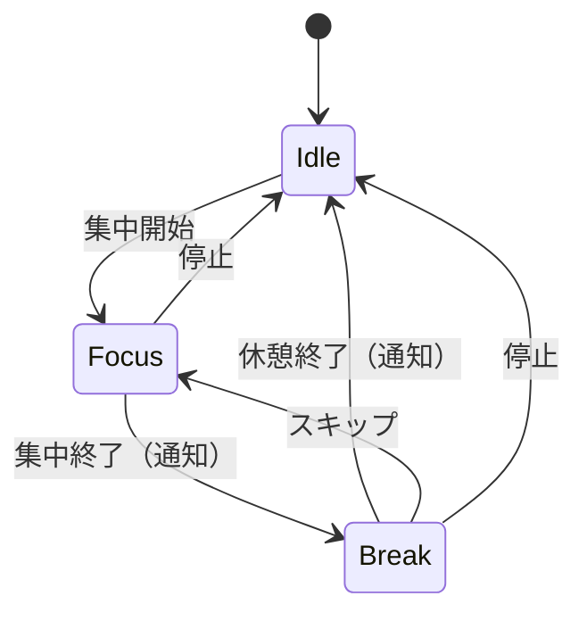

# ポモドーロ機能 実装指示書

対象画面：SCR-005（集中モード）、SCR-009（ポモドーロプリセット管理）
関連ドキュメント：screen_specifications/03_timer.md, screen_specifications/06_settings.md

---

## 概要

ポモドーロ・テクニック（集中→休憩のサイクル）を実装する。
タイマー計測（セッション記録）と連動して動作し、集中のペースメーカーとして機能する。

---

## 前提条件

- `03_timer.md`が完了していること
- `06_settings.md`のプリセットAPIが完了していること

---

## 基本仕様

### セッションとの関係

| 項目 | 説明 |
|------|------|
| 動作 | タイマー計測（セッション記録）と**同時並行**で動作 |
| 役割 | ポモドーロは集中のペースメーカー。通知で休憩を促す |
| 記録 | セッションには実際の作業時間（タイマー開始〜停止）が記録される |
| 補足 | ポモドーロの集中/休憩時間そのものは記録対象外 |

### 状態遷移



### 休憩終了後の挙動

- v2では**自動繰り返しなし**
- 休憩終了後はIdle状態に戻る
- ユーザーが手動で次の集中を開始する

---

## 実装手順

### 1. ポモドーロストア

`src/stores/pomodoroStore.ts`:
```typescript
import { create } from 'zustand';
import { persist } from 'zustand/middleware';

type PomodoroPhase = 'idle' | 'focus' | 'break';

interface PomodoroState {
  phase: PomodoroPhase;
  remainingMs: number;
  presetId: string | null;
  focusMinutes: number;
  breakMinutes: number;
  isEnabled: boolean;
}

interface PomodoroActions {
  setPreset: (preset: { id: string; focusMinutes: number; breakMinutes: number } | null) => void;
  startFocus: () => void;
  startBreak: () => void;
  skipBreak: () => void;
  tick: (deltaMs: number) => void;
  stop: () => void;
  reset: () => void;
}

const initialState: PomodoroState = {
  phase: 'idle',
  remainingMs: 0,
  presetId: null,
  focusMinutes: 25,
  breakMinutes: 5,
  isEnabled: false,
};

export const usePomodoroStore = create<PomodoroState & PomodoroActions>()(
  persist(
    (set, get) => ({
      ...initialState,

      setPreset: (preset) => {
        if (preset) {
          set({
            presetId: preset.id,
            focusMinutes: preset.focusMinutes,
            breakMinutes: preset.breakMinutes,
            isEnabled: true,
          });
        } else {
          set({
            presetId: null,
            isEnabled: false,
          });
        }
      },

      startFocus: () => {
        const { focusMinutes, isEnabled } = get();
        if (!isEnabled) return;

        set({
          phase: 'focus',
          remainingMs: focusMinutes * 60 * 1000,
        });
      },

      startBreak: () => {
        const { breakMinutes, isEnabled } = get();
        if (!isEnabled) return;

        set({
          phase: 'break',
          remainingMs: breakMinutes * 60 * 1000,
        });
      },

      skipBreak: () => {
        set({
          phase: 'idle',
          remainingMs: 0,
        });
      },

      tick: (deltaMs) => {
        const { remainingMs, phase } = get();
        if (phase === 'idle') return;

        const newRemaining = Math.max(0, remainingMs - deltaMs);
        set({ remainingMs: newRemaining });

        // 時間切れの処理は usePomodoro フック側で行う
      },

      stop: () => {
        set({
          phase: 'idle',
          remainingMs: 0,
        });
      },

      reset: () => set(initialState),
    }),
    {
      name: 'harunoa-pomodoro',
    }
  )
);
```

### 2. ポモドーロフック

`src/hooks/usePomodoro.ts`:
```typescript
'use client';

import { useEffect, useRef, useCallback } from 'react';
import { usePomodoroStore } from '@/stores/pomodoroStore';
import { useNotification } from './useNotification';
import { useSettings } from './useSettings';

export function usePomodoro() {
  const pomodoro = usePomodoroStore();
  const { notify } = useNotification();
  const { settings } = useSettings();
  const lastTickRef = useRef<number>(Date.now());
  const prevPhaseRef = useRef(pomodoro.phase);
  const prevRemainingRef = useRef(pomodoro.remainingMs);

  // タイマーのtick処理
  useEffect(() => {
    if (pomodoro.phase === 'idle' || !pomodoro.isEnabled) return;

    const interval = setInterval(() => {
      const now = Date.now();
      const delta = now - lastTickRef.current;
      lastTickRef.current = now;
      pomodoro.tick(delta);
    }, 100);

    return () => clearInterval(interval);
  }, [pomodoro.phase, pomodoro.isEnabled]);

  // 時間切れの検知と通知
  useEffect(() => {
    const wasRunning = prevRemainingRef.current > 0;
    const isFinished = pomodoro.remainingMs === 0;

    if (wasRunning && isFinished && pomodoro.phase !== 'idle') {
      if (pomodoro.phase === 'focus') {
        // 集中終了
        notify({
          title: '集中時間終了',
          message: '休憩を取りましょう',
          sound: settings?.soundEnabled ? 'focus' : null,
        });
        pomodoro.startBreak();
      } else if (pomodoro.phase === 'break') {
        // 休憩終了
        notify({
          title: '休憩終了',
          message: '次の集中を開始できます',
          sound: settings?.soundEnabled ? 'break' : null,
        });
        pomodoro.stop(); // Idle状態に戻る（手動で次を開始）
      }
    }

    prevPhaseRef.current = pomodoro.phase;
    prevRemainingRef.current = pomodoro.remainingMs;
  }, [pomodoro.remainingMs, pomodoro.phase, notify, settings?.soundEnabled]);

  // タイマー計測開始時にポモドーロも開始
  const startWithTimer = useCallback(() => {
    if (pomodoro.isEnabled && pomodoro.phase === 'idle') {
      lastTickRef.current = Date.now();
      pomodoro.startFocus();
    }
  }, [pomodoro]);

  // タイマー停止時にポモドーロも停止
  const stopWithTimer = useCallback(() => {
    pomodoro.stop();
  }, [pomodoro]);

  return {
    phase: pomodoro.phase,
    remainingMs: pomodoro.remainingMs,
    isEnabled: pomodoro.isEnabled,
    focusMinutes: pomodoro.focusMinutes,
    breakMinutes: pomodoro.breakMinutes,
    setPreset: pomodoro.setPreset,
    startFocus: pomodoro.startFocus,
    skipBreak: pomodoro.skipBreak,
    stop: pomodoro.stop,
    startWithTimer,
    stopWithTimer,
    isFocus: pomodoro.phase === 'focus',
    isBreak: pomodoro.phase === 'break',
    isIdle: pomodoro.phase === 'idle',
  };
}
```

### 3. タイマーフックとの統合

`src/hooks/useTimer.ts`に追加:
```typescript
import { usePomodoro } from './usePomodoro';

export function useTimer() {
  // 既存のコード...
  const pomodoro = usePomodoro();

  // start関数を更新
  const handleStart = useCallback((project: { id: string; name: string; color: string }) => {
    timer.start(project);
    pomodoro.startWithTimer(); // ポモドーロも開始
  }, [timer, pomodoro]);

  // stop関数を更新
  const handleStop = useCallback(async () => {
    const sessionData = timer.stop();
    pomodoro.stopWithTimer(); // ポモドーロも停止

    if (!sessionData || !user) return null;
    // 既存のセッション保存処理...
  }, [timer, pomodoro, user]);

  return {
    // 既存のreturn...
    pomodoro, // ポモドーロ状態を公開
  };
}
```

### 4. 集中モード画面の更新

`src/app/(auth)/focus/page.tsx`に追加:
```typescript
'use client';

import { useTimer } from '@/hooks/useTimer';
import { formatTime } from '@/lib/date/format';

export default function FocusPage() {
  const { pomodoro, /* 他のtimer状態 */ } = useTimer();

  return (
    <div className="min-h-screen bg-gray-900 text-white flex flex-col">
      {/* 既存のUI... */}

      {/* ポモドーロ進捗（有効時のみ表示） */}
      {pomodoro.isEnabled && (
        <div className="fixed bottom-0 left-0 right-0 p-4 bg-gray-800">
          <PomodoroProgress
            phase={pomodoro.phase}
            remainingMs={pomodoro.remainingMs}
            focusMinutes={pomodoro.focusMinutes}
            breakMinutes={pomodoro.breakMinutes}
            onSkip={pomodoro.skipBreak}
          />
        </div>
      )}
    </div>
  );
}
```

### 5. ポモドーロ進捗コンポーネント

`src/components/features/focus/PomodoroProgress.tsx`:
```typescript
'use client';

import { formatTime } from '@/lib/date/format';

interface Props {
  phase: 'idle' | 'focus' | 'break';
  remainingMs: number;
  focusMinutes: number;
  breakMinutes: number;
  onSkip: () => void;
}

export function PomodoroProgress({
  phase,
  remainingMs,
  focusMinutes,
  breakMinutes,
  onSkip,
}: Props) {
  const totalMs = phase === 'focus'
    ? focusMinutes * 60 * 1000
    : breakMinutes * 60 * 1000;

  const progress = totalMs > 0 ? ((totalMs - remainingMs) / totalMs) * 100 : 0;

  const phaseLabel = phase === 'focus' ? '集中' : phase === 'break' ? '休憩' : '待機';
  const phaseColor = phase === 'focus' ? 'bg-green-500' : 'bg-blue-500';

  return (
    <div>
      {/* プログレスバー */}
      <div className="h-2 bg-gray-600 rounded-full mb-2">
        <div
          className={`h-full rounded-full transition-all ${phaseColor}`}
          style={{ width: `${progress}%` }}
        />
      </div>

      {/* 状態と残り時間 */}
      <div className="flex justify-between items-center text-sm">
        <span>
          {phaseLabel}: {formatTime(remainingMs)} / {phase === 'focus' ? focusMinutes : breakMinutes}:00
        </span>

        {/* 休憩中のみスキップボタン */}
        {phase === 'break' && (
          <button
            onClick={onSkip}
            className="text-blue-400 hover:text-blue-300"
          >
            ⏭ スキップ
          </button>
        )}
      </div>
    </div>
  );
}
```

### 6. プリセット選択時の連携

`src/app/(auth)/timer/page.tsx`を更新:
```typescript
'use client';

import { useState, useEffect } from 'react';
import { usePomodoro } from '@/hooks/usePomodoro';
import { usePresets } from '@/hooks/usePresets';

export default function TimerPage() {
  const { presets } = usePresets();
  const { setPreset } = usePomodoro();
  const [selectedPresetId, setSelectedPresetId] = useState<string>('');

  // プリセット選択時にポモドーロストアを更新
  const handlePresetChange = (presetId: string) => {
    setSelectedPresetId(presetId);

    if (presetId) {
      const preset = presets.find((p) => p.id === presetId);
      if (preset) {
        setPreset({
          id: preset.id,
          focusMinutes: preset.focusMinutes,
          breakMinutes: preset.breakMinutes,
        });
      }
    } else {
      setPreset(null); // ポモドーロ無効化
    }
  };

  return (
    // 既存のUI...
    <select
      value={selectedPresetId}
      onChange={(e) => handlePresetChange(e.target.value)}
    >
      <option value="">使用しない</option>
      {presets.map((p) => (
        <option key={p.id} value={p.id}>
          {p.name}（{p.focusMinutes}分/{p.breakMinutes}分）
        </option>
      ))}
    </select>
  );
}
```

### 7. プリセットフック

`src/hooks/usePresets.ts`:
```typescript
'use client';

import { useState, useEffect, useCallback } from 'react';
import { useAuth } from './useAuth';
import {
  getPresets,
  createPreset,
  updatePreset,
  deletePreset,
  setActivePreset,
} from '@/services/presets';
import { PomodoroPreset, CreatePresetInput } from '@/types/preset';

export function usePresets() {
  const { user } = useAuth();
  const [presets, setPresets] = useState<PomodoroPreset[]>([]);
  const [isLoading, setIsLoading] = useState(true);
  const [error, setError] = useState<Error | null>(null);

  const fetchPresets = useCallback(async () => {
    if (!user) return;
    setIsLoading(true);
    try {
      const data = await getPresets(user.uid);
      setPresets(data);
    } catch (e) {
      setError(e as Error);
    } finally {
      setIsLoading(false);
    }
  }, [user]);

  useEffect(() => {
    fetchPresets();
  }, [fetchPresets]);

  const create = async (input: CreatePresetInput) => {
    if (!user) throw new Error('Not authenticated');
    const preset = await createPreset(user.uid, input);
    setPresets((prev) => [...prev, preset]);
    return preset;
  };

  const update = async (id: string, input: Partial<CreatePresetInput>) => {
    await updatePreset(id, input);
    await fetchPresets();
  };

  const remove = async (id: string) => {
    // アクティブなプリセットは削除不可
    const preset = presets.find((p) => p.id === id);
    if (preset?.isActive) {
      throw new Error('利用中のプリセットは削除できません');
    }
    await deletePreset(id);
    setPresets((prev) => prev.filter((p) => p.id !== id));
  };

  const setActive = async (id: string) => {
    if (!user) throw new Error('Not authenticated');
    await setActivePreset(user.uid, id);
    await fetchPresets();
  };

  const activePreset = presets.find((p) => p.isActive) || null;

  return {
    presets,
    activePreset,
    isLoading,
    error,
    create,
    update,
    remove,
    setActive,
    refresh: fetchPresets,
  };
}
```

---

## デフォルトプリセットの初期化

ユーザー初回ログイン時にデフォルトプリセットを作成する。

`src/services/presets.ts`に追加:
```typescript
export async function ensureDefaultPreset(userId: string): Promise<void> {
  const presets = await getPresets(userId);

  if (presets.length === 0) {
    // デフォルトプリセットを作成
    const defaultPreset = await createPreset(userId, {
      name: 'デフォルト',
      focusMinutes: 25,
      breakMinutes: 5,
      focusSound: 'bell',
      breakSound: 'chime',
    });
    // アクティブに設定
    await setActivePreset(userId, defaultPreset.id);
  }
}
```

`src/hooks/useAuth.ts`で呼び出し:
```typescript
useEffect(() => {
  const unsubscribe = onAuthStateChanged(async (user) => {
    if (user) {
      await ensureDefaultPreset(user.uid);
    }
    setUser(user);
  });
  return () => unsubscribe();
}, [setUser]);
```

---

## バリデーション

| 条件 | エラーメッセージ |
|------|------------------|
| プリセット名が空 | 「プリセット名を入力してください」 |
| 集中時間 < 25分 | 「集中時間は25分以上で設定してください」 |
| 休憩時間 < 5分 | 「休憩時間は5分以上で設定してください」 |
| 休憩時間 > 10分 | 「休憩時間は10分以内で設定してください。長い休憩はタイマーの停止・一時停止をご利用ください」 |
| 利用中プリセットの削除 | 「利用中のプリセットは削除できません。別のプリセットを選択してから削除してください。」 |

---

## 次のステップ

→ `09_notification.md`（通知機能の実装）
