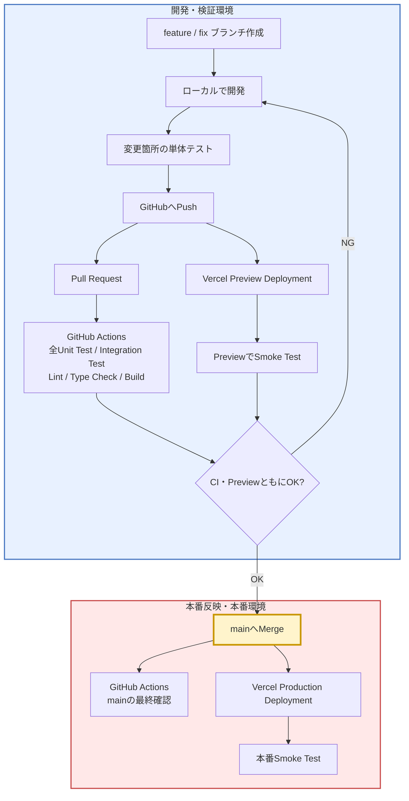

# 個人開発向け CI/CD 構成

## 1. 目的

GitHub と Vercel を使った個人開発では、**本番環境を直接変更せず、機能ブランチと Preview 環境で検証してから `main` に反映する**構成がおすすめです。

基本方針は次のとおりです。

- `main` は本番用ブランチとして扱う
- 新機能や修正は `feature/*` / `fix/*` ブランチで行う
- Pull Request（PR）で GitHub Actions を実行する
- Vercel Preview で実際の画面・動作を確認する
- PR の CI と Preview の確認が両方通ったら `main` に Merge する
- `main` への Merge 後、Vercel が Production Deployment を行う
- 本番反映後は簡単な Smoke Test を行う

---

## 2. 全体フロー



### 境界

**`main` へ Merge する瞬間が、開発・検証フェーズから本番反映フェーズへ移る境目です。**

```text
feature / fix ブランチ
Vercel Preview
Pull Request
GitHub Actions
        │
        │ ここまでは開発・検証
        ▼
==============================
        main へ Merge
==============================
        │
        │ ここから本番反映
        ▼
Vercel Production
本番Smoke Test
```

> `main` に Merge されたコードは、Vercel の Production Deployment 対象になるため、Merge 前に十分な確認を終えておくことが重要です。

---

## 3. 開発環境と本番環境

| 区分 | 対象 | 役割 |
|---|---|---|
| 開発環境 | ローカル | 実装・デバッグ |
| 開発環境 | `feature/*` / `fix/*` | 本番と分離して変更を管理 |
| 検証環境 | GitHub PR | 本番へ入れてよい変更か確認 |
| 検証環境 | GitHub Actions | 自動テスト・ビルド確認 |
| 検証環境 | Vercel Preview | 本番に近い環境で実動作確認 |
| **境界** | **`main` へ Merge** | **本番反映を開始する操作** |
| 本番環境 | `main` | 本番用コード |
| 本番環境 | Vercel Production | ユーザーが利用するアプリ |

### 環境変数・DBにも注意

Preview と Production では、可能であれば環境を分けます。

```text
Preview
├─ Preview用環境変数
└─ 開発・検証用DB

Production
├─ Production用環境変数
└─ 本番DB
```

Preview から本番 DB を直接操作すると、検証中に本番データを変更する危険があります。

---

## 4. テスト方針

### 開発中

毎回すべてのテストを実行する必要はありません。

- 変更箇所の Unit Test
- 変更に関係する Integration Test
- 必要に応じて手動確認

開発速度を落とさず、問題を早めに見つけることを重視します。

### Pull Request

本番へ入れる直前なので、**基本的に全体を確認します。**

- 全 Unit Test
- 全 Integration Test
- Lint
- Type Check
- Build

```text
PR
 │
 ├─ Unit Test
 ├─ Integration Test
 ├─ Lint
 ├─ Type Check
 └─ Build
       │
       ▼
   全て成功
       │
       ▼
   Merge可能
```

GitHub の Branch Protection / Ruleset を使い、CI が失敗している場合は `main` へ Merge できない構成にすると安全です。

---

## 5. Smoke Test

Smoke Test は、**アプリの主要機能が致命的に壊れていないかを短時間で確認するテスト**です。

網羅的なテストではなく、

> 「最低限これが動かなければリリースできない」

という重要な操作だけを確認します。

### 例

```text
ページを開ける
    ↓
ログインできる
    ↓
主要機能を実行できる
    ↓
データを保存できる
    ↓
結果を確認できる
```

### PreviewでのSmoke Test

新機能と主要機能を確認します。

- 新しく追加・修正した機能
- ログイン
- 保存
- 主要画面
- 主要なユーザーフロー

### ProductionでのSmoke Test

Production Deployment 後は、より短い確認で十分です。

- アプリが表示される
- ログインできる
- 主要機能が動く
- Production 固有の設定に問題がない

---

## 6. `main` Merge 後の GitHub Actions

`main` への Merge 後にも GitHub Actions を実行する構成がおすすめです。

ただし、役割が異なります。

| タイミング | 目的 |
|---|---|
| PR時 | **問題のあるコードを本番へ入れない** |
| `main` Merge後 | **最終的な `main` の状態を再確認する** |

最も重要なのは **PR 時の CI** です。

```text
PR
 ↓
全テスト
 ↓
成功
 ↓
mainへMerge
```

Merge 後の CI は追加の安全確認として扱います。

---

## 7. 推奨する個人開発フロー

1. `main` を最新化する
2. `feature/*` または `fix/*` ブランチを作成する
3. ローカルで開発する
4. 変更箇所の Unit Test を実行する
5. GitHub に Push する
6. Pull Request を作成する
7. GitHub Actions で全テスト・Lint・Type Check・Build を実行する
8. Vercel Preview で Smoke Test を行う
9. 問題がなければ `main` へ Merge する
10. Vercel が Production Deployment を行う
11. `main` でも GitHub Actions を実行する
12. Production で簡単な Smoke Test を行う

---

## 8. 最小構成

個人開発では、最初から複雑な CI/CD を作る必要はありません。

まずは次の構成で十分です。

```text
feature / fix
      ↓
   開発
      ↓
関連テスト
      ↓
    Push
      ↓
┌───────────────┐
│ Pull Request  │── GitHub Actions
│               │   ・全Unit Test
│               │   ・全Integration Test
│               │   ・Lint
│               │   ・Type Check
│               │   ・Build
└───────────────┘
      +
Vercel Preview
      ↓
Smoke Test
      ↓
両方OK
      ↓
================
  mainへMerge
================
      ↓
Vercel Production
      ↓
本番Smoke Test
```

### 重要な考え方

> **コードレベルの問題は GitHub Actions で止め、環境依存・画面上の問題は Vercel Preview で止める。**

この2段階の確認を通過した変更だけを `main` に入れることで、個人開発でも本番環境を壊すリスクを大きく下げられます。
