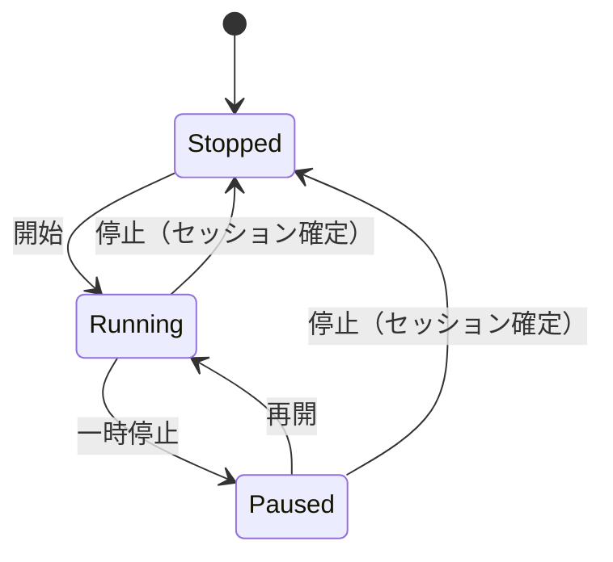
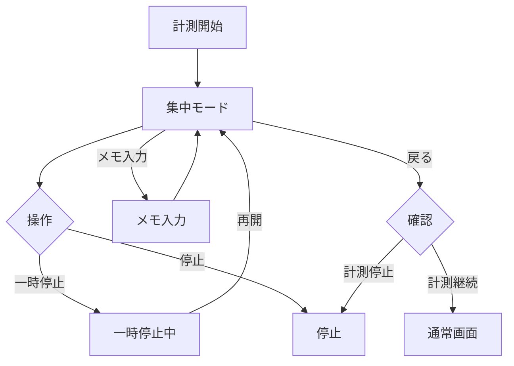

# 要件定義書（HaruNoa）

作成日：2026-01-20
元ドキュメント：requirements_v2.0.md を元に、不明確な要件を明確化
改訂：v2.1（ポモドーロ設定値の範囲・理由を明確化）

---

## 1. ドキュメント概要

本ドキュメントは、日々実施した作業を **「プロジェクト単位」** で記録・可視化し、作業の進捗（＝投入時間の推移）を把握するためのツール **HaruNoa** の要件定義書である。

- 記録対象：作業時間（必須）、作業メモ（任意）
- 主な用途：日次の振り返り、週/月の時間配分の把握、ペース作り（ポモドーロ）

> v0では「要件」セクションが省略記号（...）になっていたため、v1では第三者が実装・評価できる粒度に再構成した。

---

## 2. 用語

| 用語         | 意味                                                                           |
| ------------ | ------------------------------------------------------------------------------ |
| プロジェクト | 作業をまとめる単位（例：英語学習、個人開発、案件A）                            |
| セッション   | タイマー計測の1回分（開始〜終了）                                              |
| 計測         | タイマーで作業時間を記録する行為                                               |
| ポモドーロ   | 集中時間＋休憩時間のサイクルで作業を進める方式                                 |
| 集中モード   | 計測開始後に自動遷移するフルスクリーン寄りの計測専用画面（最小UIで集中を支援） |
| プリセット   | ポモドーロ設定（集中/休憩時間など）を名前付きで保存したもの                    |

---

## 3. 前提・スコープ

### 3.1 対象ユーザ

- v2（MVP）は **単一ユーザ（自分1人）** を想定する
- 将来：一般公開（複数ユーザ）を見据えるが、v2では必須にしない

### 3.2 対応環境

| 項目         | v2の要件                                         |
| ------------ | ------------------------------------------------ |
| ブラウザ     | Google Chrome（PC/スマホ）                       |
| 画面         | レスポンシブ対応（スマホは「計測操作」を最優先） |
| 言語         | 日本語                                           |
| タイムゾーン | 端末のローカル時間（日本利用想定）               |

### 3.3 非スコープ（v2ではやらない）

| 事項                                   | 理由                                                     |
| -------------------------------------- | -------------------------------------------------------- |
| チーム/複数ユーザでの共同利用          | v2は個人用に集中するため                                 |
| タスクを細分化した工程管理（ガント等） | 「プロジェクト単位での可視化」という設計方針に反するため |
| 高度な分析（AI提案、目標最適化など）   | MVPから外れるため                                        |
| アカウント削除機能                     | v2では不要。将来の公開版で実装する                       |

---

## 4. ゴール（ユーザ価値）

### 4.1 ユーザが達成したいこと

- 今日/今週/今月、どのプロジェクトにどれだけ時間を使ったかをすぐに把握できる
- 計測し忘れ・押し間違いが起きても、後から修正できてデータが破綻しない
- ポモドーロでペースを作れる（通知が過度にうるさくない）

### 4.2 成功条件

- 棒グラフで、プロジェクトの作業時間の合計を、日/週/月別で確認することができる
- 円グラフで、プロジェクトの割合（作業時間の割合）を可視化することができる
- 記録の修正ができ、合計が正しく再計算される
- スマホでも「開始/停止」が迷わず操作できる

---

## 5. 機能要件

### 5.1 画面一覧（v2）

| 画面             | 目的               | 主な機能                                                                                       |
| ---------------- | ------------------ | ---------------------------------------------------------------------------------------------- |
| プロジェクト一覧 | 管理の入口         | 作成/編集（名前変更）/アーカイブ、合計時間の表示                                               |
| 計測（タイマー） | すぐ計測する       | プロジェクト選択、開始/停止/一時停止、メモ入力（任意、作業内容を入力）                         |
| 集中モード       | 計測中の没入を支援 | 計測開始時に自動表示、最小UI（プロジェクト名/経過時間/停止・一時停止・再開）、メモ入力（任意） |
| 履歴             | 後から見返す/直す  | セッション一覧、手動修正、削除                                                                 |
| 集計・グラフ     | 可視化             | 日/週/月/年の集計、プロジェクト別の棒グラフ、円グラフ（プロジェクトの割合可視化）              |
| 設定             | 使い勝手調整       | ポモドーロ設定、通知ON/OFF、データ出力、ログアウト                                             |

---

### 5.2 プロジェクト管理

#### 5.2.1 プロジェクト作成

- ユーザはプロジェクトを作成できる
- **プロジェクト数の上限：無制限**
- 入力項目：
  - プロジェクト名（必須、重複は許可するが、推奨はしない）
  - 色（任意：グラフ表示用。未指定なら自動割当）

#### 5.2.2 色の自動割当ルール

- 未指定の場合、**定義済みカラーパレット（10色程度）から順番に割当**
- すべて使用済みの場合は、最初の色に戻る（ループ）

#### 5.2.3 プロジェクト一覧

- 一覧に以下を表示する
  - プロジェクト名
  - 期間合計（当日/当週/当月の切替、またはデフォルト当週）
  - 最終計測日

#### 5.2.4 編集/アーカイブ

- プロジェクト名を変更できる
- アーカイブしたプロジェクトは通常一覧から除外される（データは残す）
- **アーカイブ済みプロジェクトのセッションは、集計・グラフに含めない**
- アーカイブ済みの復帰ができる

---

### 5.3 作業計測（タイマー）

#### 5.3.1 計測の基本ルール

- 同時に計測できるのは **1プロジェクトのみ（1つのプロジェクトに集中するため）**
- 計測状態（状態遷移の定義）：

#### 5.3.2 集中モード（Focus Mode）

> 目的：計測中に「見る/考える」要素を減らし、作業に没入できる状態を作る（設計方針「集中できる環境」より）。

- 計測開始と同時に、**集中モード（別画面／フルスクリーン寄り）へ自動遷移**する
- **「フルスクリーン寄り」の定義**：ブラウザのFullscreen APIは使用せず、アプリ内で画面全体を覆う専用UIを表示する
- 集中モードの常時表示は、以下に限定する（MVP）
  - 現在計測中のプロジェクト名
  - 経過時間（最も視認性を高く）
  - 操作：一時停止／再開／停止
  - 計測状態（例：「記録中」）
- 集中モード中に「作業メモ」を入力できる（任意・自由記述1欄）
  - メモは未入力（空）でも問題ない
  - 入力中も計測は継続する（メモはオーバーレイ表示などで集中画面に戻れること）
- 集中モードから離脱（戻る/閉じる）しようとした場合、確認ダイアログを表示する
  - 選択肢：
    1) 「計測は継続して戻る」
    2) 「計測停止して戻る」
- 計測中に別プロジェクトの計測を開始しようとした場合は、注意表示に加えて**2ステップ（警告→確定操作）**を必須とする（誤操作防止）

#### 5.3.3 タイマー操作

| 操作     | 挙動                                               |
| -------- | -------------------------------------------------- |
| 開始     | 選択したプロジェクトで計測開始し、開始時刻を保存   |
| 一時停止 | 計測を止めるがセッションは継続（経過は加算停止）   |
| 再開     | 一時停止中の計測を再開                             |
| 停止     | セッションを確定（終了時刻を保存、合計時間を計算） |

#### 5.3.4 タイマー操作のエラーハンドリング

| エラー状況 | 挙動 |
| ---------- | ---- |
| 操作がサーバに反映されない | 画面上にエラー表示し、リトライボタンを表示する |
| リトライ失敗（3回） | 「オフラインモードで継続」を案内し、ローカル記録に切り替える |

#### 5.3.5 プロジェクト切替時の挙動

- 計測中に別プロジェクトを開始した場合：
  - 現在の計測を自動停止してセッション確定
  - その後、選択したプロジェクトの計測を開始
- ユーザが意図せず切替しないよう、UI上で注意表示を行う（例：「現在の計測を終了して切り替えます」）

#### 5.3.6 作業メモ（任意）

- セッションごとにメモ（短文）を保存できる
- 例：やったこと/詰まった点/次やること

---

### 5.4 履歴（セッション管理）

#### 5.4.1 履歴の表示

- 日付でフィルタできる（例：今日/昨日/カレンダー選択）
- セッション一覧に以下を表示：
  - プロジェクト名
  - 開始時刻 / 終了時刻
  - 計測時間
  - メモ（任意）
- **ソート順：新しい順（デフォルト）**
- **ページネーション：1ページあたり50件**

#### 5.4.2 手動修正

- 押し忘れ等に対応するため、以下を可能にする
  - 開始時刻/終了時刻の修正
  - 計測時間を直接入力して補正（開始/終了は自動計算でも可）
  - メモの修正
- 修正後は集計値・グラフを再計算する

#### 5.4.3 手動修正のバリデーション

| 条件 | エラー内容 |
| ---- | ---------- |
| 開始時刻 > 終了時刻 | 「開始時刻は終了時刻より前にしてください」と表示し、保存を拒否 |
| 終了時刻が未来 | 「終了時刻は現在時刻より後にできません」と表示し、保存を拒否 |

#### 5.4.4 削除

- セッションを削除できる（取り消し確認を表示）

#### 5.4.5 日付跨ぎの扱い（ルール）

- セッションが日付を跨ぐ場合、**時間を日付ごとに按分**して集計する
  例：23:50〜00:10 → 前日10分、翌日10分として計上
- **複数日跨ぎ（24時間以上）の場合**：各日に24時間を上限として按分する
  例：1/1 10:00〜1/3 10:00（48時間）→ 1/1: 14時間、1/2: 24時間、1/3: 10時間

---

### 5.5 集計・可視化

#### 5.5.1 集計粒度

- 日 / 週 / 月 / 年の4種類を提供する

#### 5.5.2 週の定義

- 週の開始は **月曜日** とする（日本利用を想定）

#### 5.5.3 表示

- 各期間（日/週/月/年）で以下を表示する
  - プロジェクト別合計時間（表）
  - プロジェクト別合計時間（棒グラフ）
  - プロジェクトの作業割合（円グラフ）
  - 期間合計（全プロジェクト合計）

---

### 5.6 ポモドーロ

#### 5.6.1 ポモドーロとセッションの関係

- **ポモドーロの記録はセッション（作業時間）とは別管理**とする
- ポモドーロの集中時間・休憩時間は、プロジェクトの作業時間には含めない
- ポモドーロはあくまで「集中と休憩のリズムを作る手段」として扱う

#### 5.6.2 デフォルト値（プリセット）

- v2では、デフォルト値（集中25分・休憩5分）を **「プリセット（初期設定）」** として提供する
- ユーザはデフォルト値そのものを上書き変更するのではなく、**新しい時間設定のポモドーロタイマー（プリセット）を作成して保存**できる

#### 5.6.3 プリセットの作成・保存（カスタマイズ）

- ユーザは複数のポモドーロプリセットを作成し、名前を付けて保存できる
- **プリセット数の上限：無制限**
- プリセットで設定できる項目は以下の通り

| 項目               | 設定範囲         | 理由・補足                                                                 |
| ------------------ | ---------------- | -------------------------------------------------------------------------- |
| 集中時間           | 25分〜上限なし   | ポモドーロ・テクニックの標準（25分）を下限とする。短時間集中は本ツールの対象外 |
| 休憩時間           | 5分〜10分        | 15分以上の休憩はタイマーの「停止」または「一時停止」で対応する             |
| 通知音（集中終了） | 選択式（無音可） | 集中が終了したときの通知音を選択できる                                     |
| 通知音（休憩終了） | 選択式（無音可） | 休憩が終了したときの通知音を選択できる                                     |

- プリセットの管理（最低限）
  - 作成
  - 名前変更
  - 削除
  - 利用中プリセットの選択（計測画面または設定画面から）

#### 5.6.4 設定値のバリデーション

| 条件 | エラー内容 |
| ---- | ---------- |
| 集中時間 < 25分 | 「集中時間は25分以上で設定してください」と表示し、保存を拒否 |
| 休憩時間 < 5分 | 「休憩時間は5分以上で設定してください」と表示し、保存を拒否 |
| 休憩時間 > 10分 | 「休憩時間は10分以内で設定してください。長い休憩はタイマーの停止・一時停止をご利用ください」と表示し、保存を拒否 |

#### 5.6.5 動作

- 選択中のプリセットに従って、集中→休憩をカウントする
- ポモドーロの終了時に通知する（詳細は「通知要件」）
- 自動繰り返しは **OFFがデフォルト**（将来拡張）
- **休憩スキップ機能**：休憩中に「スキップ」ボタンを押すと、休憩を終了し次の集中を開始できる

### 5.7 通知（音・画面）

#### 5.7.1 通知の種類

- ポモドーロの「集中終了」「休憩終了」を通知する
- v2では通知手段を次の範囲に限定：
  - 音（ON/OFF）
  - ブラウザ通知（ON/OFF、許可が必要）

#### 5.7.2 ユーザ設定

- 音ON/OFF
- ブラウザ通知ON/OFF
- 音量は端末側に従う（v2ではアプリ側音量調整は任意）
- デフォルト挙動（集中を妨げないため）

  - **通知音：OFF（無音）**
  - **画面表示：ON**（ブラウザ通知が許可されていない場合は、アプリ内表示で代替）
- ユーザが設定で「通知音：ON」に切り替えることで、**音＋画面表示**に変更できる

#### 5.7.3 アプリ内通知の表示仕様

- ブラウザ通知が許可されていない場合の代替として、**画面上部にバナー形式で通知を表示**する
- バナーは5秒後に自動で消える（または手動で閉じる）

---

### 5.8 データ管理

#### 5.8.1 データ保持期間

- セッションデータの保持期間は **1年間**
- 1年を超えたセッションデータは **自動的にアーカイブ**される
- アーカイブされたデータは通常の集計・グラフには含まれない
- アーカイブデータはCSVエクスポートで取得可能

#### 5.8.2 データ出力（バックアップ）

- CSVエクスポートを提供する
  - プロジェクト
  - セッション履歴（開始/終了/時間/メモ）
  - アーカイブ済みセッション
- 将来的にインポートは検討（v2は非スコープ）

---

### 5.9 認証・アカウント

#### 5.9.1 ログイン

- **ユーザ認証は、Google認証とする**
- Googleログインにより、利用者本人のみがデータへアクセスできること
- 認証に失敗した場合は、アプリ機能（閲覧/計測/編集）を利用できないこと

#### 5.9.2 ログアウト

- 設定画面から **ログアウト**できる
- ログアウト後はログイン画面に遷移する

#### 5.9.3 アカウント削除

- v2では非スコープ（将来の公開版で実装）

---

## 6. 非機能要件

| 項目   | 要件                                                                                                                           |
| ------ | ------------------------------------------------------------------------------------------------------------------------------ |
| 可用性 | 一般的なWebサービスとしてアクセスできること                                                                                    |
| 性能   | 直近1年分のセッションを扱っても一覧・集計が **3秒以内** にレスポンスすること                                                   |
| 操作性 | スマホおよびパソコンで、プロジェクト選択→タイマー選択→計測開始、という操作をストレスなく行える（できるだけ1画面で完結）      |
| 信頼性 | 通信断やブラウザクラッシュが起きても、直近の計測状態が復元できる（可能な範囲で）。計測中の通信遮断時の挙動は下記「補足」を参照 |
| 保守性 | 後からログイン/複数ユーザ化しやすい構造にする                                                                                  |

### 6.1 補足（計測中に通信遮断が発生した場合の挙動）

- **基本方針**：通信状態に依存せず、計測（カウント）は継続できること（集中を途切れさせない）
- **通信遮断を検知したら**
  - 画面上に「オフライン（通信が切れています）」を表示する
  - 以降の操作（開始/一時停止/再開/停止）は **ローカルに記録** し、復帰後に反映する（キューイング）
- **計測中（Running）の扱い**
  - 計測開始時刻（startAt）をローカルに保持し、画面は端末時刻ベースで経過時間を表示する
  - オフライン中にページを閉じたり再読み込みしても、次回起動時に **「計測継続中」** を復元できる（startAtと状態を保持する）
- **通信復帰したら**
  - ローカルに溜めたイベント（開始/停止など）を時刻付きで送信し、サーバ保存方式の場合は順に反映する（失敗時は再試行）
  - 端末内保存方式の場合は、ローカル保存のみで完結する（送信は行わない）
- **矛盾が起きた場合（例：復帰時に二重登録が疑われる）**
  - セッションの一意性（セッションID）で重複を防ぎ、必要なら「履歴」画面でユーザが手動修正できる

### 6.2 複数端末での同時操作時の競合解決

- **基本ルール：後勝ち（Last Write Wins）**
- 同一セッションに対して複数端末から同時に操作があった場合、**タイムスタンプが新しい操作を採用**する
- 競合が発生した場合、ユーザは履歴画面で手動修正できる

---

## 7. インフラ要件

- 外部サービスにデプロイし、インターネット経由で利用できること
- **複数端末で利用できるように、サーバ保存（データベース）を採用する**（PC/スマホ間で同じデータを参照できる）

---

## 8. セキュリティ要件

- v2は個人利用を想定し、第三者が勝手に閲覧/操作できないこと
- **ユーザ認証は、Google認証とする。**
  - Googleログインにより、利用者本人のみがデータへアクセスできること
  - 認証に失敗した場合は、アプリ機能（閲覧/計測/編集）を利用できないこと

> 将来的に一般公開する場合は、利用規約/プライバシー/削除依頼対応などを別途定義する。

---

## 9. 設計方針（v0の方針を明文化）

- **プロジェクトを細かく分類しすぎない**タスク粒度の工程管理ではなく、プロジェクト単位の時間可視化に価値を置く。
- 記録し忘れを前提に、**後から直せる**ことを重視する。
- ユーザに集中できる環境を提供する。
- 集中を妨げる要素（グラフ・履歴・複雑な設定など）は、計測中に極力表示しない
- 計測開始後は自動的に集中モード（フルスクリーン寄りの別画面）へ遷移し、最小限の情報と操作のみ提供する
- 誤操作（意図しない停止・切替）で集中が切れないように、離脱や切替には確認手順を設ける
- 通知は過度にうるさくしない（デフォルトは無音＋画面表示）
- ユーザに入力を強制しない。（余計な作業は発生させない）

---

## 10. 懸念点と対応方針

| 懸念点（v0）               | v2での対応方針                                                       |
| -------------------------- | -------------------------------------------------------------------- |
| ブラウザから音を鳴らせるか | 音ON/OFFとブラウザ通知ON/OFFを用意。鳴らせない環境は通知で補完する   |
| レスポンシブ設計が難しい   | v2はスマホ最優先で「計測操作」を中心に設計する（画面数を増やさない） |

---

## 11. 受け入れ条件（できた判定）

| No | 条件                                                               |
| -: | ------------------------------------------------------------------ |
|  1 | プロジェクトを作成/編集/アーカイブできる                           |
|  2 | 1プロジェクトのみ計測でき、開始/一時停止/再開/停止が動く           |
|  3 | セッション履歴が一覧で見られ、手動修正できる                       |
|  4 | 日/週/月/年で集計が見られ、プロジェクト別の棒グラフが表示される    |
|  5 | 日/週/月/年で円グラフ（プロジェクト割合）が表示される              |
|  6 | ポモドーロ（25/5、カスタム可）が動き、通知ON/OFFが設定できる       |
|  7 | ポモドーロの休憩をスキップできる                                   |
|  8 | CSVエクスポートができる                                            |
|  9 | Google認証でログイン/ログアウトできる                              |
| 10 | 複数端末で同じデータを参照できる                                   |

---

## 12. 変更履歴

| バージョン | 日付       | 変更内容                                             |
| ---------- | ---------- | ---------------------------------------------------- |
| v0         | 2026-01-19 | 初版作成                                             |
| v1         | 2026-01-20 | 第三者が実装・評価できる粒度に再構成                 |
| v1.5       | 2026-01-20 | 集中モード／通知デフォルトの追記                     |
| v2.0       | 2026-01-21 | 要件漏れの追記、不明確な要件の明確化                 |
| v2.1       | 2026-01-21 | ポモドーロ設定値の範囲・理由・バリデーションを明確化 |

### v2.1での主な追加・変更点

| カテゴリ | 追加・変更内容 |
| -------- | -------------- |
| ポモドーロ | 集中時間の下限（25分）の理由を明記 |
| ポモドーロ | 休憩時間の範囲（5〜10分）の理由を明記（15分以上は停止・一時停止で対応） |
| ポモドーロ | 設定値のバリデーション（5.6.4）を新規追加 |
