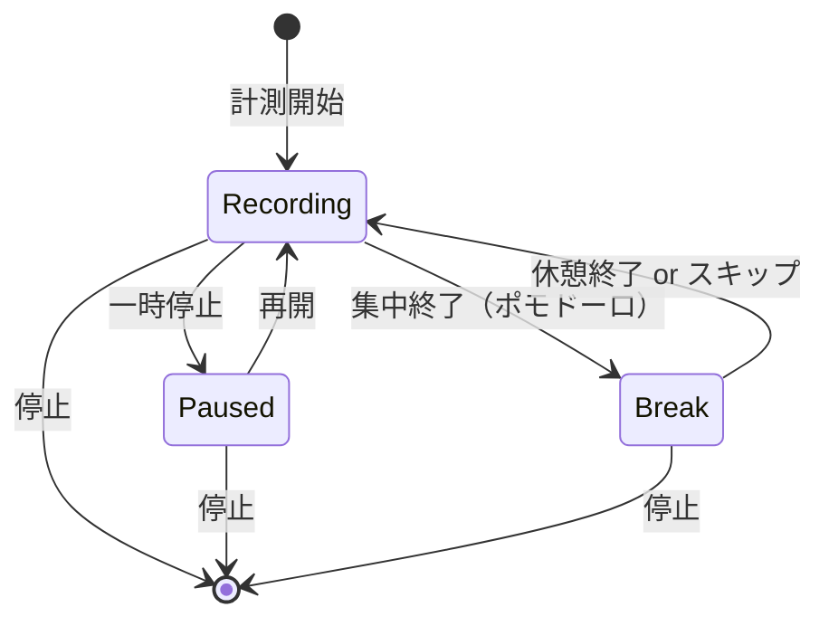

# 画面仕様書 v0（HaruNoa）

作成日：2026-01-21
関連ドキュメント：requirements_v2.1.md

---

## 1. ドキュメント概要

本ドキュメントは、作業時間可視化ツール **HaruNoa** の画面仕様書である。
要件定義書（requirements_v2.1.md）に基づき、各画面の目的・機能・UI要素を定義する。

---

## 2. 用語

| 用語 | 意味 |
|------|------|
| プロジェクト | 作業をまとめる単位（例：英語学習、個人開発、案件A） |
| セッション | タイマー計測の1回分（開始〜終了） |
| ポモドーロ | 集中時間＋休憩時間のサイクルで作業を進める方式 |
| 集中モード | 計測開始後に自動遷移するフルスクリーン寄りの計測専用画面 |
| プリセット | ポモドーロ設定（集中/休憩時間など）を名前付きで保存したもの |
| グローバルナビゲーション | 全画面共通で表示されるメニュー。主要画面への遷移手段 |
| モーダル | 画面上に重ねて表示されるダイアログ。操作完了まで背景操作不可 |
| オーバーレイ | 画面上に重ねて表示されるUI。背景が半透明で見える状態 |
| トースト | 画面端に一時的に表示される通知メッセージ |
| バリデーション | 入力値が正しいかを検証する処理 |

---

## 3. 画面一覧

| No | 画面ID | 画面名 | 画面目的 | 認証要否 |
|:--:|--------|--------|----------|:--------:|
| 1 | SCR-001 | ログイン画面 | 認証の入口 | 不要 |
| 2 | SCR-002 | プロジェクト一覧（ホーム） | 管理の入口・起点画面 | 必要 |
| 3 | SCR-003 | アーカイブ一覧 | アーカイブ済みプロジェクトの管理 | 必要 |
| 4 | SCR-004 | 計測（タイマー） | 計測を開始する | 必要 |
| 5 | SCR-005 | 集中モード | 計測中の没入を支援 | 必要 |
| 6 | SCR-006 | 履歴 | 後から見返す・修正する | 必要 |
| 7 | SCR-007 | 集計・グラフ | 作業時間の可視化 | 必要 |
| 8 | SCR-008 | 設定 | 使い勝手の調整 | 必要 |
| 9 | SCR-009 | ポモドーロプリセット管理 | ポモドーロ設定のカスタマイズ | 必要 |

---

## 4. 画面遷移図

```
┌─────────────────────────────────────────────────────────────────────────┐
│                          HaruNoa 画面遷移図                              │
├─────────────────────────────────────────────────────────────────────────┤
│                                                                          │
│    ┌────────────┐                                                       │
│    │  SCR-001   │                                                       │
│    │ログイン画面 │ ←── 未認証時 / ログアウト後                           │
│    └─────┬──────┘                                                       │
│          │ Google認証成功                                               │
│          ▼                                                              │
│    ┌────────────────┐                                                   │
│    │    SCR-002     │                                                   │
│    │プロジェクト一覧 │ ←── ログイン後の起点画面（ホーム）                 │
│    │   （ホーム）    │                                                   │
│    └──┬────┬────┬──┘                                                   │
│       │    │    │                                                       │
│       │    │    └────────────────────────┐                              │
│       │    │                             ▼                              │
│       │    │                      ┌────────────┐                        │
│       │    │                      │  SCR-003   │                        │
│       │    │                      │アーカイブ一覧│                       │
│       │    │                      └────────────┘                        │
│       │    │                                                            │
│       │    └──────────────┐                                             │
│       │                   ▼                                             │
│       │            ┌────────────┐                                       │
│       │            │  SCR-004   │                                       │
│       │            │計測(タイマー)│                                      │
│       │            └─────┬──────┘                                       │
│       │                  │ 計測開始（自動遷移）                          │
│       │                  ▼                                              │
│       │            ┌────────────┐                                       │
│       │            │  SCR-005   │                                       │
│       │            │ 集中モード  │                                       │
│       │            └────────────┘                                       │
│       │                                                                 │
│       ▼                                                                 │
│  ┌─────────┐  ┌─────────┐  ┌─────────┐  ┌─────────────────┐            │
│  │ SCR-006 │  │ SCR-007 │  │ SCR-008 │  │     SCR-009     │            │
│  │  履歴   │  │集計･グラフ│ │  設定   │  │ポモドーロプリセット│           │
│  └─────────┘  └─────────┘  └─────────┘  └─────────────────┘            │
│                                                                          │
└─────────────────────────────────────────────────────────────────────────┘
```

---

## 5. グローバルナビゲーション

### 5.1 概要

全画面（ログイン画面・集中モードを除く）に共通のナビゲーションを配置し、主要画面への遷移を提供する。

### 5.2 ナビゲーション項目

| No | 項目名 | アイコン | 遷移先 | 備考 |
|:--:|--------|----------|--------|------|
| 1 | ホーム | 🏠 | SCR-002 プロジェクト一覧 | 起点画面 |
| 2 | 計測 | ▶️ | SCR-004 計測（タイマー） | |
| 3 | 履歴 | 📋 | SCR-006 履歴 | |
| 4 | 集計 | 📊 | SCR-007 集計・グラフ | |
| 5 | 設定 | ⚙️ | SCR-008 設定 | |

### 5.3 レスポンシブ対応

| デバイス | 配置 | 形式 |
|----------|------|------|
| PC | 画面上部 | 横並びヘッダーメニュー |
| スマホ | 画面下部 | タブバー（固定表示） |

### 5.4 表示仕様

- 現在表示中の画面に対応する項目はハイライト表示する
- 集中モード（SCR-005）ではナビゲーションを非表示にする
- ログイン画面（SCR-001）ではナビゲーションを非表示にする

---

## 6. 画面詳細仕様

---

### 6.1 SCR-001：ログイン画面

#### 6.1.1 画面概要

| 項目 | 内容 |
|------|------|
| 画面ID | SCR-001 |
| 画面名 | ログイン画面 |
| 目的 | ユーザー認証を行い、アプリケーションへのアクセスを許可する |
| 認証要否 | 不要（未認証ユーザーがアクセスする画面） |
| 遷移元 | 直接アクセス、ログアウト後 |
| 遷移先 | SCR-002 プロジェクト一覧（認証成功時） |

#### 6.1.2 画面レイアウト（概要）

```
┌─────────────────────────────────────┐
│                                     │
│           ┌─────────┐               │
│           │  ロゴ   │               │
│           │ HaruNoa │               │
│           └─────────┘               │
│                                     │
│        アプリの説明テキスト          │
│                                     │
│      ┌─────────────────────┐        │
│      │ Googleでログイン     │        │
│      └─────────────────────┘        │
│                                     │
│         [エラーメッセージ]           │
│                                     │
└─────────────────────────────────────┘
```

#### 6.1.3 UI要素一覧

| No | 要素ID | 要素種別 | 要素名 | 説明 | 必須 |
|:--:|--------|----------|--------|------|:----:|
| 1 | L001-01 | 画像 | アプリロゴ | HaruNoaのロゴを表示 | ○ |
| 2 | L001-02 | テキスト | アプリ説明 | アプリの簡単な説明文 | ○ |
| 3 | L001-03 | ボタン | Googleログインボタン | Google OAuth認証を開始 | ○ |
| 4 | L001-04 | テキスト | エラーメッセージ | 認証エラー時に表示 | - |

#### 6.1.4 機能仕様

| No | 機能 | トリガー | 処理内容 |
|:--:|------|----------|----------|
| 1 | Google認証開始 | Googleログインボタン押下 | Google OAuth認証フローを開始 |
| 2 | 認証成功 | Google認証完了 | SCR-002 プロジェクト一覧へ遷移 |
| 3 | 認証エラー表示 | Google認証失敗 | エラーメッセージを表示 |

#### 6.1.5 エラー・バリデーション

| No | 条件 | エラーメッセージ | 表示位置 |
|:--:|------|------------------|----------|
| 1 | Google認証失敗 | 「ログインに失敗しました。もう一度お試しください。」 | L001-04 |
| 2 | 通信エラー | 「通信エラーが発生しました。ネットワーク接続を確認してください。」 | L001-04 |

#### 6.1.6 レスポンシブ対応

| 項目 | PC | スマホ |
|------|-----|--------|
| レイアウト | 中央寄せ、最大幅400px | 全幅、左右パディング16px |
| ロゴサイズ | 120px | 80px |

---

### 6.2 SCR-002：プロジェクト一覧（ホーム）

#### 6.2.1 画面概要

| 項目 | 内容 |
|------|------|
| 画面ID | SCR-002 |
| 画面名 | プロジェクト一覧（ホーム） |
| 目的 | プロジェクトの管理と作業状況の確認を行う起点画面 |
| 認証要否 | 必要 |
| 遷移元 | SCR-001 ログイン画面、グローバルナビゲーション |
| 遷移先 | SCR-003 アーカイブ一覧、SCR-004 計測（タイマー） |

#### 6.2.2 画面レイアウト（概要）

```
┌─────────────────────────────────────────────────────┐
│ [グローバルナビゲーション]                           │
├─────────────────────────────────────────────────────┤
│                                                     │
│  プロジェクト一覧          [+ 新規作成] [アーカイブ] │
│                                                     │
│  期間: [当日 ▼] [当週] [当月]                       │
│                                                     │
│  ┌───────────────────────────────────────────────┐ │
│  │ 🔵 プロジェクトA                              │ │
│  │    合計: 5時間30分  最終計測: 2026/01/21      │ │
│  │    [編集] [アーカイブ] [計測開始 ▶]           │ │
│  ├───────────────────────────────────────────────┤ │
│  │ 🟢 プロジェクトB                              │ │
│  │    合計: 2時間15分  最終計測: 2026/01/20      │ │
│  │    [編集] [アーカイブ] [計測開始 ▶]           │ │
│  ├───────────────────────────────────────────────┤ │
│  │ 🟡 プロジェクトC                              │ │
│  │    合計: 0分  最終計測: -                      │ │
│  │    [編集] [アーカイブ] [計測開始 ▶]           │ │
│  └───────────────────────────────────────────────┘ │
│                                                     │
│  [プロジェクトがない場合の案内テキスト]              │
│                                                     │
├─────────────────────────────────────────────────────┤
│ [タブバー（スマホのみ）]                             │
└─────────────────────────────────────────────────────┘
```

#### 6.2.3 UI要素一覧

| No | 要素ID | 要素種別 | 要素名 | 説明 | 必須 |
|:--:|--------|----------|--------|------|:----:|
| 1 | L002-01 | ボタン | 新規作成ボタン | プロジェクト作成モーダルを開く | ○ |
| 2 | L002-02 | ボタン | アーカイブボタン | SCR-003 アーカイブ一覧へ遷移 | ○ |
| 3 | L002-03 | セグメントコントロール | 期間切替 | 当日/当週/当月を切り替え | ○ |
| 4 | L002-04 | リスト | プロジェクトリスト | プロジェクト一覧を表示 | ○ |
| 5 | L002-05 | アイコン | プロジェクト色 | プロジェクトに設定された色を表示 | ○ |
| 6 | L002-06 | テキスト | プロジェクト名 | プロジェクト名を表示 | ○ |
| 7 | L002-07 | テキスト | 合計時間 | 選択期間の合計時間を表示 | ○ |
| 8 | L002-08 | テキスト | 最終計測日 | 最後に計測した日付を表示 | ○ |
| 9 | L002-09 | ボタン | 編集ボタン | プロジェクト編集モーダルを開く | ○ |
| 10 | L002-10 | ボタン | アーカイブボタン（行） | 該当プロジェクトをアーカイブ | ○ |
| 11 | L002-11 | ボタン | 計測開始ボタン | SCR-004へ遷移し、該当プロジェクトを選択状態にする | ○ |
| 12 | L002-12 | テキスト | 空状態メッセージ | プロジェクトが0件の場合に表示 | - |

#### 6.2.4 モーダル：プロジェクト作成

```
┌─────────────────────────────────────┐
│ プロジェクト作成            [×]     │
├─────────────────────────────────────┤
│                                     │
│  プロジェクト名 *                   │
│  ┌─────────────────────────────┐   │
│  │                             │   │
│  └─────────────────────────────┘   │
│                                     │
│  色（任意）                         │
│  ○🔵 ○🟢 ○🟡 ○🟠 ○🔴            │
│  ○🟣 ○🟤 ○⚫ ○⚪ ○🩵            │
│  ☑ 自動割当                        │
│                                     │
│  [キャンセル]        [作成]         │
│                                     │
└─────────────────────────────────────┘
```

| No | 要素ID | 要素種別 | 要素名 | 説明 | 必須 |
|:--:|--------|----------|--------|------|:----:|
| 1 | M002-01 | テキスト入力 | プロジェクト名 | プロジェクト名を入力 | ○ |
| 2 | M002-02 | カラーピッカー | 色選択 | 10色から選択、または自動割当 | - |
| 3 | M002-03 | チェックボックス | 自動割当 | 色を自動で割り当てる | - |
| 4 | M002-04 | ボタン | キャンセルボタン | モーダルを閉じる | ○ |
| 5 | M002-05 | ボタン | 作成ボタン | プロジェクトを作成 | ○ |

#### 6.2.5 モーダル：プロジェクト編集

```
┌─────────────────────────────────────┐
│ プロジェクト編集            [×]     │
├─────────────────────────────────────┤
│                                     │
│  プロジェクト名 *                   │
│  ┌─────────────────────────────┐   │
│  │ プロジェクトA               │   │
│  └─────────────────────────────┘   │
│                                     │
│  色                                 │
│  ●🔵 ○🟢 ○🟡 ○🟠 ○🔴            │
│  ○🟣 ○🟤 ○⚫ ○⚪ ○🩵            │
│                                     │
│  [キャンセル]        [保存]         │
│                                     │
└─────────────────────────────────────┘
```

| No | 要素ID | 要素種別 | 要素名 | 説明 | 必須 |
|:--:|--------|----------|--------|------|:----:|
| 1 | M003-01 | テキスト入力 | プロジェクト名 | プロジェクト名を編集 | ○ |
| 2 | M003-02 | カラーピッカー | 色選択 | 10色から選択 | ○ |
| 3 | M003-03 | ボタン | キャンセルボタン | モーダルを閉じる | ○ |
| 4 | M003-04 | ボタン | 保存ボタン | 変更を保存 | ○ |

#### 6.2.6 機能仕様

| No | 機能 | トリガー | 処理内容 |
|:--:|------|----------|----------|
| 1 | プロジェクト作成 | 作成ボタン押下 | 入力内容でプロジェクトを作成し、一覧に追加 |
| 2 | プロジェクト編集 | 保存ボタン押下 | 入力内容でプロジェクトを更新 |
| 3 | プロジェクトアーカイブ | アーカイブボタン押下 | 確認後、プロジェクトをアーカイブ |
| 4 | 期間切替 | セグメント選択 | 合計時間の集計期間を切り替え |
| 5 | 計測開始 | 計測開始ボタン押下 | SCR-004へ遷移し、該当プロジェクトを選択状態にする |
| 6 | アーカイブ一覧へ遷移 | アーカイブボタン押下 | SCR-003へ遷移 |

#### 6.2.7 エラー・バリデーション

| No | 条件 | エラーメッセージ | 表示位置 |
|:--:|------|------------------|----------|
| 1 | プロジェクト名が空 | 「プロジェクト名を入力してください」 | M002-01/M003-01の下 |
| 2 | 通信エラー | 「保存に失敗しました。もう一度お試しください。」 | トースト |

#### 6.2.8 レスポンシブ対応

| 項目 | PC | スマホ |
|------|-----|--------|
| プロジェクトリスト | カード形式、2列グリッド | リスト形式、1列 |
| 操作ボタン | 常時表示 | スワイプまたはメニューボタンで表示 |
| 期間切替 | 横並び | 横並び（コンパクト） |

---

### 6.3 SCR-003：アーカイブ一覧

#### 6.3.1 画面概要

| 項目 | 内容 |
|------|------|
| 画面ID | SCR-003 |
| 画面名 | アーカイブ一覧 |
| 目的 | アーカイブ済みプロジェクトの確認と復帰操作 |
| 認証要否 | 必要 |
| 遷移元 | SCR-002 プロジェクト一覧 |
| 遷移先 | SCR-002 プロジェクト一覧（戻る） |

#### 6.3.2 画面レイアウト（概要）

```
┌─────────────────────────────────────────────────────┐
│ [グローバルナビゲーション]                           │
├─────────────────────────────────────────────────────┤
│                                                     │
│  [← 戻る] アーカイブ一覧                            │
│                                                     │
│  ┌───────────────────────────────────────────────┐ │
│  │ 🔵 アーカイブ済みプロジェクトA                 │ │
│  │    アーカイブ日: 2026/01/15                    │ │
│  │    [復帰]                                      │ │
│  ├───────────────────────────────────────────────┤ │
│  │ 🟢 アーカイブ済みプロジェクトB                 │ │
│  │    アーカイブ日: 2026/01/10                    │ │
│  │    [復帰]                                      │ │
│  └───────────────────────────────────────────────┘ │
│                                                     │
│  [アーカイブ済みプロジェクトがない場合の案内]        │
│                                                     │
├─────────────────────────────────────────────────────┤
│ [タブバー（スマホのみ）]                             │
└─────────────────────────────────────────────────────┘
```

#### 6.3.3 UI要素一覧

| No | 要素ID | 要素種別 | 要素名 | 説明 | 必須 |
|:--:|--------|----------|--------|------|:----:|
| 1 | L003-01 | ボタン | 戻るボタン | SCR-002へ戻る | ○ |
| 2 | L003-02 | リスト | アーカイブリスト | アーカイブ済みプロジェクト一覧 | ○ |
| 3 | L003-03 | アイコン | プロジェクト色 | プロジェクトに設定された色を表示 | ○ |
| 4 | L003-04 | テキスト | プロジェクト名 | プロジェクト名を表示 | ○ |
| 5 | L003-05 | テキスト | アーカイブ日 | アーカイブした日付を表示 | ○ |
| 6 | L003-06 | ボタン | 復帰ボタン | プロジェクトをアーカイブから復帰 | ○ |
| 7 | L003-07 | テキスト | 空状態メッセージ | アーカイブが0件の場合に表示 | - |

#### 6.3.4 機能仕様

| No | 機能 | トリガー | 処理内容 |
|:--:|------|----------|----------|
| 1 | 復帰 | 復帰ボタン押下 | 確認後、プロジェクトを通常一覧に戻す |
| 2 | 戻る | 戻るボタン押下 | SCR-002へ遷移 |

#### 6.3.5 レスポンシブ対応

| 項目 | PC | スマホ |
|------|-----|--------|
| レイアウト | リスト形式 | リスト形式 |
| 復帰ボタン | 常時表示 | 常時表示 |

---

### 6.4 SCR-004：計測（タイマー）

#### 6.4.1 画面概要

| 項目 | 内容 |
|------|------|
| 画面ID | SCR-004 |
| 画面名 | 計測（タイマー） |
| 目的 | プロジェクトとポモドーロプリセットを選択し、計測を開始する |
| 認証要否 | 必要 |
| 遷移元 | グローバルナビゲーション、SCR-002 プロジェクト一覧 |
| 遷移先 | SCR-005 集中モード（計測開始時に自動遷移） |

#### 6.4.2 画面レイアウト（概要）

```
┌─────────────────────────────────────────────────────┐
│ [グローバルナビゲーション]                           │
├─────────────────────────────────────────────────────┤
│                                                     │
│                     計測                            │
│                                                     │
│  プロジェクト選択 *                                 │
│  ┌─────────────────────────────────────────────┐   │
│  │ 🔵 プロジェクトA                        ▼   │   │
│  └─────────────────────────────────────────────┘   │
│                                                     │
│  ポモドーロプリセット（任意）                        │
│  ┌─────────────────────────────────────────────┐   │
│  │ デフォルト（25分/5分）                  ▼   │   │
│  └─────────────────────────────────────────────┘   │
│  [プリセット管理 →]                                 │
│                                                     │
│            ┌─────────────────────┐                 │
│            │                     │                 │
│            │    ▶ 計測開始       │                 │
│            │                     │                 │
│            └─────────────────────┘                 │
│                                                     │
├─────────────────────────────────────────────────────┤
│ [タブバー（スマホのみ）]                             │
└─────────────────────────────────────────────────────┘
```

#### 6.4.3 UI要素一覧

| No | 要素ID | 要素種別 | 要素名 | 説明 | 必須 |
|:--:|--------|----------|--------|------|:----:|
| 1 | L004-01 | ドロップダウン | プロジェクト選択 | 計測対象のプロジェクトを選択 | ○ |
| 2 | L004-02 | ドロップダウン | プリセット選択 | ポモドーロプリセットを選択 | - |
| 3 | L004-03 | リンク | プリセット管理リンク | SCR-009へ遷移 | ○ |
| 4 | L004-04 | ボタン | 計測開始ボタン | 計測を開始し、SCR-005へ自動遷移 | ○ |

#### 6.4.4 モーダル：計測中の別プロジェクト開始警告

```
┌─────────────────────────────────────┐
│ 計測中のプロジェクトがあります [×]   │
├─────────────────────────────────────┤
│                                     │
│  現在「プロジェクトA」を計測中です。 │
│  計測を終了して、新しいプロジェクト  │
│  の計測を開始しますか？              │
│                                     │
│  [キャンセル]  [計測を切り替える]    │
│                                     │
└─────────────────────────────────────┘
```

| No | 要素ID | 要素種別 | 要素名 | 説明 | 必須 |
|:--:|--------|----------|--------|------|:----:|
| 1 | M004-01 | テキスト | 警告メッセージ | 現在の計測状況を表示 | ○ |
| 2 | M004-02 | ボタン | キャンセルボタン | モーダルを閉じる | ○ |
| 3 | M004-03 | ボタン | 切替ボタン | 現在の計測を停止し、新しい計測を開始 | ○ |

#### 6.4.5 機能仕様

| No | 機能 | トリガー | 処理内容 |
|:--:|------|----------|----------|
| 1 | プロジェクト選択 | ドロップダウン選択 | 計測対象プロジェクトを設定 |
| 2 | プリセット選択 | ドロップダウン選択 | ポモドーロプリセットを設定 |
| 3 | 計測開始 | 計測開始ボタン押下 | 計測を開始し、SCR-005へ自動遷移 |
| 4 | 計測切替警告 | 計測中に別プロジェクト開始時 | 2ステップ確認（警告→確定）を表示 |
| 5 | 計測切替実行 | 切替ボタン押下 | 現在の計測を停止し、新しい計測を開始 |

#### 6.4.6 エラー・バリデーション

| No | 条件 | エラーメッセージ | 表示位置 |
|:--:|------|------------------|----------|
| 1 | プロジェクト未選択で開始 | 「プロジェクトを選択してください」 | L004-01の下 |
| 2 | 通信エラー | 「計測の開始に失敗しました。もう一度お試しください。」 | トースト |

#### 6.4.7 レスポンシブ対応

| 項目 | PC | スマホ |
|------|-----|--------|
| レイアウト | 中央寄せ、最大幅500px | 全幅、パディング16px |
| 計測開始ボタン | 大きめ（高さ60px） | さらに大きめ（高さ80px）、タップしやすく |

---

### 6.5 SCR-005：集中モード

#### 6.5.1 画面概要

| 項目 | 内容 |
|------|------|
| 画面ID | SCR-005 |
| 画面名 | 集中モード |
| 目的 | 計測中の没入を支援し、最小限のUIで集中を維持する |
| 認証要否 | 必要 |
| 遷移元 | SCR-004 計測（タイマー）から自動遷移 |
| 遷移先 | 任意の画面（離脱時確認後） |

#### 6.5.2 画面レイアウト（概要）

```
┌─────────────────────────────────────────────────────┐
│                                                     │
│  [← 戻る]                              [メモ 📝]   │
│                                                     │
│                                                     │
│                  🔵 プロジェクトA                  │
│                                                     │
│                      記録中                         │
│                                                     │
│                                                     │
│                    ┌─────────┐                     │
│                    │         │                     │
│                    │ 1:23:45 │                     │
│                    │         │                     │
│                    └─────────┘                     │
│                                                     │
│                                                     │
│       [⏸ 一時停止]              [⏹ 停止]         │
│                                                     │
│                                                     │
│  ─────────────────────────────────────────────     │
│  ポモドーロ: 集中 15:00 / 25:00                    │
│  ─────────────────────────────────────────────     │
│                                                     │
└─────────────────────────────────────────────────────┘
```

#### 6.5.3 画面レイアウト（一時停止中）

```
┌─────────────────────────────────────────────────────┐
│                                                     │
│  [← 戻る]                              [メモ 📝]   │
│                                                     │
│                                                     │
│                  🔵 プロジェクトA                  │
│                                                     │
│                    一時停止中                       │
│                                                     │
│                                                     │
│                    ┌─────────┐                     │
│                    │         │                     │
│                    │ 1:23:45 │                     │
│                    │         │                     │
│                    └─────────┘                     │
│                                                     │
│                                                     │
│       [▶ 再開]                  [⏹ 停止]          │
│                                                     │
│                                                     │
└─────────────────────────────────────────────────────┘
```

#### 6.5.4 画面レイアウト（ポモドーロ休憩中）

```
┌─────────────────────────────────────────────────────┐
│                                                     │
│  [← 戻る]                              [メモ 📝]   │
│                                                     │
│                                                     │
│                  🔵 プロジェクトA                  │
│                                                     │
│                     休憩中                          │
│                                                     │
│                                                     │
│                    ┌─────────┐                     │
│                    │         │                     │
│                    │  3:45   │                     │
│                    │         │                     │
│                    └─────────┘                     │
│                                                     │
│                                                     │
│       [⏭ スキップ]             [⏹ 停止]          │
│                                                     │
│                                                     │
│  ─────────────────────────────────────────────     │
│  休憩: 3:45 / 5:00                                 │
│  ─────────────────────────────────────────────     │
│                                                     │
└─────────────────────────────────────────────────────┘
```

#### 6.5.5 UI要素一覧

| No | 要素ID | 要素種別 | 要素名 | 説明 | 必須 |
|:--:|--------|----------|--------|------|:----:|
| 1 | L005-01 | ボタン | 戻るボタン | 離脱確認ダイアログを表示 | ○ |
| 2 | L005-02 | ボタン | メモボタン | メモ入力オーバーレイを表示 | ○ |
| 3 | L005-03 | アイコン | プロジェクト色 | 計測中のプロジェクト色 | ○ |
| 4 | L005-04 | テキスト | プロジェクト名 | 計測中のプロジェクト名 | ○ |
| 5 | L005-05 | テキスト | 計測状態 | 「記録中」「一時停止中」「休憩中」 | ○ |
| 6 | L005-06 | テキスト | 経過時間 | 大きく視認性高く表示（HH:MM:SS） | ○ |
| 7 | L005-07 | ボタン | 一時停止ボタン | 計測を一時停止（記録中のみ表示） | ○ |
| 8 | L005-08 | ボタン | 再開ボタン | 計測を再開（一時停止中のみ表示） | ○ |
| 9 | L005-09 | ボタン | 停止ボタン | セッションを確定して終了 | ○ |
| 10 | L005-10 | ボタン | スキップボタン | 休憩をスキップ（休憩中のみ表示） | ○ |
| 11 | L005-11 | プログレスバー | ポモドーロ進捗 | 集中/休憩の進捗を表示 | - |
| 12 | L005-12 | テキスト | ポモドーロ時間 | 現在のフェーズと残り時間 | - |
| 13 | L005-13 | バナー | 通知バナー | ポモドーロ通知を表示（5秒で自動消去） | - |
| 14 | L005-14 | バナー | オフライン表示 | 通信断時に表示 | - |

#### 6.5.6 オーバーレイ：メモ入力

```
┌─────────────────────────────────────┐
│ メモ                        [×]     │
├─────────────────────────────────────┤
│                                     │
│  ┌─────────────────────────────┐   │
│  │                             │   │
│  │ やったこと、詰まった点など   │   │
│  │                             │   │
│  │                             │   │
│  └─────────────────────────────┘   │
│                                     │
│  [キャンセル]        [保存]         │
│                                     │
└─────────────────────────────────────┘
```

| No | 要素ID | 要素種別 | 要素名 | 説明 | 必須 |
|:--:|--------|----------|--------|------|:----:|
| 1 | O005-01 | テキストエリア | メモ入力欄 | 自由記述 | - |
| 2 | O005-02 | ボタン | キャンセルボタン | オーバーレイを閉じる（入力破棄） | ○ |
| 3 | O005-03 | ボタン | 保存ボタン | メモを保存してオーバーレイを閉じる | ○ |

#### 6.5.7 モーダル：離脱確認

```
┌─────────────────────────────────────┐
│ 計測中です                   [×]    │
├─────────────────────────────────────┤
│                                     │
│  計測中の画面から離れます。         │
│  どうしますか？                     │
│                                     │
│  [計測を継続して戻る]               │
│                                     │
│  [計測を停止して戻る]               │
│                                     │
└─────────────────────────────────────┘
```

| No | 要素ID | 要素種別 | 要素名 | 説明 | 必須 |
|:--:|--------|----------|--------|------|:----:|
| 1 | M005-01 | ボタン | 継続して戻るボタン | 計測を継続したまま前画面へ | ○ |
| 2 | M005-02 | ボタン | 停止して戻るボタン | 計測を停止して前画面へ | ○ |

#### 6.5.8 機能仕様

| No | 機能 | トリガー | 処理内容 |
|:--:|------|----------|----------|
| 1 | 一時停止 | 一時停止ボタン押下 | 計測を一時停止（経過時間の加算を停止） |
| 2 | 再開 | 再開ボタン押下 | 一時停止中の計測を再開 |
| 3 | 停止 | 停止ボタン押下 | セッションを確定し、計測を終了 |
| 4 | 休憩スキップ | スキップボタン押下 | 休憩を終了し、次の集中フェーズを開始 |
| 5 | メモ入力 | メモボタン押下 | メモ入力オーバーレイを表示 |
| 6 | メモ保存 | 保存ボタン押下 | メモをセッションに保存 |
| 7 | 離脱確認 | 戻るボタン押下 | 離脱確認モーダルを表示 |
| 8 | 計測継続して戻る | 継続ボタン押下 | 計測を継続したまま前画面へ遷移 |
| 9 | 計測停止して戻る | 停止ボタン押下 | 計測を停止して前画面へ遷移 |
| 10 | ポモドーロ通知 | 集中/休憩終了時 | 通知バナーを表示（5秒後自動消去） |
| 11 | オフライン表示 | 通信断検知 | オフラインバナーを表示 |

#### 6.5.9 状態遷移



#### 6.5.10 レスポンシブ対応

| 項目 | PC | スマホ |
|------|-----|--------|
| 経過時間フォントサイズ | 72px | 56px |
| 操作ボタンサイズ | 60px × 60px | 80px × 80px（タップしやすく） |
| レイアウト | 中央寄せ | 中央寄せ、縦方向に余白確保 |

---

### 6.6 SCR-006：履歴

#### 6.6.1 画面概要

| 項目 | 内容 |
|------|------|
| 画面ID | SCR-006 |
| 画面名 | 履歴 |
| 目的 | 過去のセッションを確認し、必要に応じて修正・削除する |
| 認証要否 | 必要 |
| 遷移元 | グローバルナビゲーション |
| 遷移先 | - |

#### 6.6.2 画面レイアウト（概要）

```
┌─────────────────────────────────────────────────────┐
│ [グローバルナビゲーション]                           │
├─────────────────────────────────────────────────────┤
│                                                     │
│  履歴                                               │
│                                                     │
│  日付: [今日 ▼] [昨日] [カレンダー 📅]             │
│                                                     │
│  ┌───────────────────────────────────────────────┐ │
│  │ 🔵 プロジェクトA                              │ │
│  │    10:00 - 11:30（1時間30分）                 │ │
│  │    メモ: タスクAの実装を完了                   │ │
│  │    [編集] [削除]                              │ │
│  ├───────────────────────────────────────────────┤ │
│  │ 🟢 プロジェクトB                              │ │
│  │    14:00 - 15:15（1時間15分）                 │ │
│  │    メモ: -                                    │ │
│  │    [編集] [削除]                              │ │
│  ├───────────────────────────────────────────────┤ │
│  │ 🔵 プロジェクトA                              │ │
│  │    16:00 - 17:30（1時間30分）                 │ │
│  │    メモ: バグ修正                             │ │
│  │    [編集] [削除]                              │ │
│  └───────────────────────────────────────────────┘ │
│                                                     │
│  [< 前へ] 1 / 3 [次へ >]                           │
│                                                     │
├─────────────────────────────────────────────────────┤
│ [タブバー（スマホのみ）]                             │
└─────────────────────────────────────────────────────┘
```

#### 6.6.3 UI要素一覧

| No | 要素ID | 要素種別 | 要素名 | 説明 | 必須 |
|:--:|--------|----------|--------|------|:----:|
| 1 | L006-01 | セグメントコントロール | 日付フィルタ | 今日/昨日を切り替え | ○ |
| 2 | L006-02 | ボタン | カレンダーボタン | カレンダーで日付を選択 | ○ |
| 3 | L006-03 | リスト | セッションリスト | セッション一覧を表示 | ○ |
| 4 | L006-04 | アイコン | プロジェクト色 | セッションのプロジェクト色 | ○ |
| 5 | L006-05 | テキスト | プロジェクト名 | セッションのプロジェクト名 | ○ |
| 6 | L006-06 | テキスト | 時刻 | 開始時刻 - 終了時刻 | ○ |
| 7 | L006-07 | テキスト | 計測時間 | セッションの計測時間 | ○ |
| 8 | L006-08 | テキスト | メモ | セッションのメモ（未入力は「-」） | ○ |
| 9 | L006-09 | ボタン | 編集ボタン | セッション編集モーダルを開く | ○ |
| 10 | L006-10 | ボタン | 削除ボタン | 削除確認モーダルを開く | ○ |
| 11 | L006-11 | ページネーション | ページ切替 | 前へ/次へ、現在ページ表示 | ○ |
| 12 | L006-12 | テキスト | 空状態メッセージ | セッションが0件の場合に表示 | - |

#### 6.6.4 モーダル：セッション編集

```
┌─────────────────────────────────────┐
│ セッション編集              [×]     │
├─────────────────────────────────────┤
│                                     │
│  プロジェクト                       │
│  🔵 プロジェクトA（変更不可）       │
│                                     │
│  開始時刻 *                         │
│  ┌─────────────────────────────┐   │
│  │ 2026/01/21 10:00           │   │
│  └─────────────────────────────┘   │
│                                     │
│  終了時刻 *                         │
│  ┌─────────────────────────────┐   │
│  │ 2026/01/21 11:30           │   │
│  └─────────────────────────────┘   │
│                                     │
│  計測時間: 1時間30分                │
│                                     │
│  メモ                               │
│  ┌─────────────────────────────┐   │
│  │ タスクAの実装を完了          │   │
│  └─────────────────────────────┘   │
│                                     │
│  [キャンセル]        [保存]         │
│                                     │
└─────────────────────────────────────┘
```

| No | 要素ID | 要素種別 | 要素名 | 説明 | 必須 |
|:--:|--------|----------|--------|------|:----:|
| 1 | M006-01 | テキスト | プロジェクト名 | 変更不可（表示のみ） | ○ |
| 2 | M006-02 | 日時入力 | 開始時刻 | 開始時刻を編集 | ○ |
| 3 | M006-03 | 日時入力 | 終了時刻 | 終了時刻を編集 | ○ |
| 4 | M006-04 | テキスト | 計測時間 | 開始・終了から自動計算（表示のみ） | ○ |
| 5 | M006-05 | テキストエリア | メモ | メモを編集 | - |
| 6 | M006-06 | ボタン | キャンセルボタン | モーダルを閉じる | ○ |
| 7 | M006-07 | ボタン | 保存ボタン | 変更を保存 | ○ |

#### 6.6.5 モーダル：削除確認

```
┌─────────────────────────────────────┐
│ セッション削除              [×]     │
├─────────────────────────────────────┤
│                                     │
│  このセッションを削除しますか？     │
│                                     │
│  🔵 プロジェクトA                   │
│  10:00 - 11:30（1時間30分）         │
│                                     │
│  ※ この操作は取り消せません         │
│                                     │
│  [キャンセル]        [削除]         │
│                                     │
└─────────────────────────────────────┘
```

| No | 要素ID | 要素種別 | 要素名 | 説明 | 必須 |
|:--:|--------|----------|--------|------|:----:|
| 1 | M007-01 | テキスト | 確認メッセージ | 削除対象の情報を表示 | ○ |
| 2 | M007-02 | ボタン | キャンセルボタン | モーダルを閉じる | ○ |
| 3 | M007-03 | ボタン | 削除ボタン | セッションを削除 | ○ |

#### 6.6.6 機能仕様

| No | 機能 | トリガー | 処理内容 |
|:--:|------|----------|----------|
| 1 | 日付フィルタ | セグメント選択 | 選択した日付のセッションを表示 |
| 2 | カレンダー選択 | カレンダーボタン押下 | カレンダーから日付を選択 |
| 3 | セッション編集 | 編集ボタン押下 | 編集モーダルを表示 |
| 4 | セッション保存 | 保存ボタン押下 | 変更を保存し、集計を再計算 |
| 5 | セッション削除 | 削除ボタン押下 | 削除確認モーダルを表示 |
| 6 | 削除実行 | 削除確認後 | セッションを削除し、集計を再計算 |
| 7 | ページ切替 | ページネーション操作 | 指定ページのセッションを表示 |

#### 6.6.7 エラー・バリデーション

| No | 条件 | エラーメッセージ | 表示位置 |
|:--:|------|------------------|----------|
| 1 | 開始時刻 > 終了時刻 | 「開始時刻は終了時刻より前にしてください」 | M006-02の下 |
| 2 | 終了時刻が未来 | 「終了時刻は現在時刻より後にできません」 | M006-03の下 |
| 3 | 通信エラー | 「保存に失敗しました。もう一度お試しください。」 | トースト |

#### 6.6.8 レスポンシブ対応

| 項目 | PC | スマホ |
|------|-----|--------|
| セッションリスト | カード形式 | リスト形式（コンパクト） |
| 操作ボタン | 常時表示 | スワイプまたはメニューボタンで表示 |
| ページネーション | 下部中央 | 下部中央 |

---

### 6.7 SCR-007：集計・グラフ

#### 6.7.1 画面概要

| 項目 | 内容 |
|------|------|
| 画面ID | SCR-007 |
| 画面名 | 集計・グラフ |
| 目的 | 作業時間をプロジェクト別に可視化し、時間配分を把握する |
| 認証要否 | 必要 |
| 遷移元 | グローバルナビゲーション |
| 遷移先 | - |

#### 6.7.2 画面レイアウト（概要）

```
┌─────────────────────────────────────────────────────┐
│ [グローバルナビゲーション]                           │
├─────────────────────────────────────────────────────┤
│                                                     │
│  集計・グラフ                                       │
│                                                     │
│  期間: [日 ▼] [週] [月] [年]    [< 前] [次 >]      │
│        2026年1月21日（火）                          │
│                                                     │
│  ┌───────────────────────────────────────────────┐ │
│  │              プロジェクト別 作業時間            │ │
│  │                                                │ │
│  │  プロジェクトA ████████████████████  5h30m     │ │
│  │  プロジェクトB ██████████           2h15m      │ │
│  │  プロジェクトC ██                    0h30m     │ │
│  │                                                │ │
│  │  合計: 8時間15分                               │ │
│  └───────────────────────────────────────────────┘ │
│                                                     │
│  ┌───────────────────────────────────────────────┐ │
│  │              プロジェクト割合                   │ │
│  │                                                │ │
│  │          ┌─────────────┐                      │ │
│  │         /  A: 67%      \                      │ │
│  │        |    B: 27%      |                     │ │
│  │         \   C: 6%      /                      │ │
│  │          └─────────────┘                      │ │
│  │                                                │ │
│  └───────────────────────────────────────────────┘ │
│                                                     │
│  ┌───────────────────────────────────────────────┐ │
│  │              プロジェクト別 合計時間（表）      │ │
│  │                                                │ │
│  │  プロジェクト名    │ 合計時間  │ 割合         │ │
│  │  ─────────────────┼───────────┼────────      │ │
│  │  プロジェクトA     │ 5h30m     │ 67%          │ │
│  │  プロジェクトB     │ 2h15m     │ 27%          │ │
│  │  プロジェクトC     │ 0h30m     │ 6%           │ │
│  │  ─────────────────┼───────────┼────────      │ │
│  │  合計              │ 8h15m     │ 100%         │ │
│  └───────────────────────────────────────────────┘ │
│                                                     │
├─────────────────────────────────────────────────────┤
│ [タブバー（スマホのみ）]                             │
└─────────────────────────────────────────────────────┘
```

#### 6.7.3 UI要素一覧

| No | 要素ID | 要素種別 | 要素名 | 説明 | 必須 |
|:--:|--------|----------|--------|------|:----:|
| 1 | L007-01 | セグメントコントロール | 期間切替 | 日/週/月/年を切り替え | ○ |
| 2 | L007-02 | ボタン | 前へボタン | 前の期間へ移動 | ○ |
| 3 | L007-03 | ボタン | 次へボタン | 次の期間へ移動 | ○ |
| 4 | L007-04 | テキスト | 期間表示 | 現在表示中の期間 | ○ |
| 5 | L007-05 | グラフ | 棒グラフ | プロジェクト別作業時間を棒グラフで表示 | ○ |
| 6 | L007-06 | テキスト | 合計時間 | 全プロジェクトの合計時間 | ○ |
| 7 | L007-07 | グラフ | 円グラフ | プロジェクト割合を円グラフで表示 | ○ |
| 8 | L007-08 | 表 | 合計時間表 | プロジェクト別の合計時間と割合 | ○ |

#### 6.7.4 機能仕様

| No | 機能 | トリガー | 処理内容 |
|:--:|------|----------|----------|
| 1 | 期間切替 | セグメント選択 | 選択した粒度（日/週/月/年）で集計を表示 |
| 2 | 前の期間へ | 前へボタン押下 | 1つ前の期間の集計を表示 |
| 3 | 次の期間へ | 次へボタン押下 | 1つ次の期間の集計を表示 |

#### 6.7.5 表示仕様

| 項目 | 仕様 |
|------|------|
| 週の開始 | 月曜日 |
| 時間表示形式 | Xh Ym（例：5h 30m） |
| 割合表示 | 小数点以下切り捨て、合計100%に調整 |
| データなしの場合 | 「この期間のデータはありません」と表示 |
| アーカイブ済みプロジェクト | 集計に含めない |

#### 6.7.6 レスポンシブ対応

| 項目 | PC | スマホ |
|------|-----|--------|
| グラフ配置 | 棒グラフと円グラフを横並び | 縦並び |
| 表の表示 | 3列表示 | 2列表示（割合を省略） |
| グラフサイズ | 400px × 300px | 全幅 × 200px |

---

### 6.8 SCR-008：設定

#### 6.8.1 画面概要

| 項目 | 内容 |
|------|------|
| 画面ID | SCR-008 |
| 画面名 | 設定 |
| 目的 | 通知設定、データ出力、ログアウトなどの各種設定を行う |
| 認証要否 | 必要 |
| 遷移元 | グローバルナビゲーション |
| 遷移先 | SCR-009 ポモドーロプリセット管理、SCR-001 ログイン画面（ログアウト後） |

#### 6.8.2 画面レイアウト（概要）

```
┌─────────────────────────────────────────────────────┐
│ [グローバルナビゲーション]                           │
├─────────────────────────────────────────────────────┤
│                                                     │
│  設定                                               │
│                                                     │
│  ┌───────────────────────────────────────────────┐ │
│  │ 通知設定                                       │ │
│  ├───────────────────────────────────────────────┤ │
│  │ 通知音                              [OFF ○●]  │ │
│  │ ブラウザ通知                        [OFF ○●]  │ │
│  │ （ブラウザの許可が必要です）                   │ │
│  └───────────────────────────────────────────────┘ │
│                                                     │
│  ┌───────────────────────────────────────────────┐ │
│  │ ポモドーロ                                     │ │
│  ├───────────────────────────────────────────────┤ │
│  │ [プリセット管理 →]                            │ │
│  └───────────────────────────────────────────────┘ │
│                                                     │
│  ┌───────────────────────────────────────────────┐ │
│  │ データ管理                                     │ │
│  ├───────────────────────────────────────────────┤ │
│  │ [CSVエクスポート]                             │ │
│  │  - プロジェクト                                │ │
│  │  - セッション履歴                              │ │
│  │  - アーカイブ済みセッション                    │ │
│  └───────────────────────────────────────────────┘ │
│                                                     │
│  ┌───────────────────────────────────────────────┐ │
│  │ アカウント                                     │ │
│  ├───────────────────────────────────────────────┤ │
│  │ ログイン中: user@example.com                  │ │
│  │ [ログアウト]                                  │ │
│  └───────────────────────────────────────────────┘ │
│                                                     │
│  ┌───────────────────────────────────────────────┐ │
│  │ アプリ情報                                     │ │
│  ├───────────────────────────────────────────────┤ │
│  │ バージョン: 2.0.0                             │ │
│  └───────────────────────────────────────────────┘ │
│                                                     │
├─────────────────────────────────────────────────────┤
│ [タブバー（スマホのみ）]                             │
└─────────────────────────────────────────────────────┘
```

#### 6.8.3 UI要素一覧

| No | 要素ID | 要素種別 | 要素名 | 説明 | 必須 |
|:--:|--------|----------|--------|------|:----:|
| 1 | L008-01 | トグル | 通知音トグル | 通知音のON/OFF | ○ |
| 2 | L008-02 | トグル | ブラウザ通知トグル | ブラウザ通知のON/OFF | ○ |
| 3 | L008-03 | テキスト | ブラウザ通知説明 | 許可が必要な旨を表示 | ○ |
| 4 | L008-04 | ボタン | プリセット管理リンク | SCR-009へ遷移 | ○ |
| 5 | L008-05 | ボタン | CSVエクスポートボタン | エクスポートモーダルを開く | ○ |
| 6 | L008-06 | テキスト | ログインユーザー | ログイン中のメールアドレス | ○ |
| 7 | L008-07 | ボタン | ログアウトボタン | ログアウト確認モーダルを開く | ○ |
| 8 | L008-08 | テキスト | バージョン | アプリのバージョン情報 | ○ |

#### 6.8.4 モーダル：CSVエクスポート

```
┌─────────────────────────────────────┐
│ CSVエクスポート             [×]     │
├─────────────────────────────────────┤
│                                     │
│  エクスポートするデータを選択       │
│                                     │
│  ☑ プロジェクト                     │
│  ☑ セッション履歴                   │
│  ☐ アーカイブ済みセッション         │
│                                     │
│  [キャンセル]        [エクスポート]  │
│                                     │
└─────────────────────────────────────┘
```

| No | 要素ID | 要素種別 | 要素名 | 説明 | 必須 |
|:--:|--------|----------|--------|------|:----:|
| 1 | M008-01 | チェックボックス | プロジェクト | プロジェクトデータをエクスポート | - |
| 2 | M008-02 | チェックボックス | セッション履歴 | セッションデータをエクスポート | - |
| 3 | M008-03 | チェックボックス | アーカイブ済み | アーカイブ済みセッションをエクスポート | - |
| 4 | M008-04 | ボタン | キャンセルボタン | モーダルを閉じる | ○ |
| 5 | M008-05 | ボタン | エクスポートボタン | 選択したデータをCSVでダウンロード | ○ |

#### 6.8.5 モーダル：ログアウト確認

```
┌─────────────────────────────────────┐
│ ログアウト                  [×]     │
├─────────────────────────────────────┤
│                                     │
│  ログアウトしますか？               │
│                                     │
│  [キャンセル]        [ログアウト]   │
│                                     │
└─────────────────────────────────────┘
```

| No | 要素ID | 要素種別 | 要素名 | 説明 | 必須 |
|:--:|--------|----------|--------|------|:----:|
| 1 | M009-01 | ボタン | キャンセルボタン | モーダルを閉じる | ○ |
| 2 | M009-02 | ボタン | ログアウトボタン | ログアウトを実行 | ○ |

#### 6.8.6 機能仕様

| No | 機能 | トリガー | 処理内容 |
|:--:|------|----------|----------|
| 1 | 通知音切替 | トグル操作 | 通知音のON/OFFを保存 |
| 2 | ブラウザ通知切替 | トグル操作 | ブラウザ通知のON/OFFを保存（ONの場合は許可を要求） |
| 3 | プリセット管理へ遷移 | リンク押下 | SCR-009へ遷移 |
| 4 | CSVエクスポート | エクスポートボタン押下 | 選択したデータをCSVファイルでダウンロード |
| 5 | ログアウト | ログアウトボタン押下 | ログアウトしてSCR-001へ遷移 |

#### 6.8.7 レスポンシブ対応

| 項目 | PC | スマホ |
|------|-----|--------|
| レイアウト | 中央寄せ、最大幅600px | 全幅、パディング16px |
| セクション間隔 | 24px | 16px |

---

### 6.9 SCR-009：ポモドーロプリセット管理

#### 6.9.1 画面概要

| 項目 | 内容 |
|------|------|
| 画面ID | SCR-009 |
| 画面名 | ポモドーロプリセット管理 |
| 目的 | ポモドーロのプリセット（集中/休憩時間設定）を作成・管理する |
| 認証要否 | 必要 |
| 遷移元 | SCR-004 計測（タイマー）、SCR-008 設定 |
| 遷移先 | 遷移元へ戻る |

#### 6.9.2 画面レイアウト（概要）

```
┌─────────────────────────────────────────────────────┐
│ [グローバルナビゲーション]                           │
├─────────────────────────────────────────────────────┤
│                                                     │
│  [← 戻る] ポモドーロプリセット管理     [+ 新規作成] │
│                                                     │
│  ┌───────────────────────────────────────────────┐ │
│  │ ● デフォルト                        [利用中]  │ │
│  │   集中: 25分 / 休憩: 5分                      │ │
│  │   通知音: 集中終了 ベル / 休憩終了 チャイム    │ │
│  │   [編集] [削除]                               │ │
│  ├───────────────────────────────────────────────┤ │
│  │ ○ 長時間集中                                  │ │
│  │   集中: 50分 / 休憩: 10分                     │ │
│  │   通知音: 集中終了 無音 / 休憩終了 無音       │ │
│  │   [編集] [削除] [利用する]                    │ │
│  ├───────────────────────────────────────────────┤ │
│  │ ○ 短め休憩                                    │ │
│  │   集中: 30分 / 休憩: 5分                      │ │
│  │   通知音: 集中終了 ベル / 休憩終了 ベル       │ │
│  │   [編集] [削除] [利用する]                    │ │
│  └───────────────────────────────────────────────┘ │
│                                                     │
├─────────────────────────────────────────────────────┤
│ [タブバー（スマホのみ）]                             │
└─────────────────────────────────────────────────────┘
```

#### 6.9.3 UI要素一覧

| No | 要素ID | 要素種別 | 要素名 | 説明 | 必須 |
|:--:|--------|----------|--------|------|:----:|
| 1 | L009-01 | ボタン | 戻るボタン | 遷移元へ戻る | ○ |
| 2 | L009-02 | ボタン | 新規作成ボタン | プリセット作成モーダルを開く | ○ |
| 3 | L009-03 | リスト | プリセットリスト | プリセット一覧を表示 | ○ |
| 4 | L009-04 | ラジオボタン | 選択状態 | 利用中のプリセットを示す | ○ |
| 5 | L009-05 | テキスト | プリセット名 | プリセットの名前 | ○ |
| 6 | L009-06 | バッジ | 利用中バッジ | 現在利用中のプリセットに表示 | - |
| 7 | L009-07 | テキスト | 集中/休憩時間 | 設定された時間を表示 | ○ |
| 8 | L009-08 | テキスト | 通知音設定 | 設定された通知音を表示 | ○ |
| 9 | L009-09 | ボタン | 編集ボタン | プリセット編集モーダルを開く | ○ |
| 10 | L009-10 | ボタン | 削除ボタン | 削除確認モーダルを開く | ○ |
| 11 | L009-11 | ボタン | 利用するボタン | 該当プリセットを利用中に設定 | ○ |

#### 6.9.4 モーダル：プリセット作成/編集

```
┌─────────────────────────────────────┐
│ プリセット作成              [×]     │
├─────────────────────────────────────┤
│                                     │
│  プリセット名 *                     │
│  ┌─────────────────────────────┐   │
│  │                             │   │
│  └─────────────────────────────┘   │
│                                     │
│  集中時間 *                         │
│  ┌─────────────────────────────┐   │
│  │ 25                      分  │   │
│  └─────────────────────────────┘   │
│  ※ 25分以上で設定してください       │
│                                     │
│  休憩時間 *                         │
│  ┌─────────────────────────────┐   │
│  │ 5                       分  │   │
│  └─────────────────────────────┘   │
│  ※ 5〜10分で設定してください        │
│                                     │
│  通知音（集中終了）                  │
│  ┌─────────────────────────────┐   │
│  │ 無音                    ▼   │   │
│  └─────────────────────────────┘   │
│                                     │
│  通知音（休憩終了）                  │
│  ┌─────────────────────────────┐   │
│  │ 無音                    ▼   │   │
│  └─────────────────────────────┘   │
│                                     │
│  [キャンセル]        [作成]         │
│                                     │
└─────────────────────────────────────┘
```

| No | 要素ID | 要素種別 | 要素名 | 説明 | 必須 |
|:--:|--------|----------|--------|------|:----:|
| 1 | M010-01 | テキスト入力 | プリセット名 | プリセット名を入力 | ○ |
| 2 | M010-02 | 数値入力 | 集中時間 | 25分以上を入力 | ○ |
| 3 | M010-03 | 数値入力 | 休憩時間 | 5〜10分を入力 | ○ |
| 4 | M010-04 | ドロップダウン | 通知音（集中終了） | 無音/ベル/チャイムなどから選択 | ○ |
| 5 | M010-05 | ドロップダウン | 通知音（休憩終了） | 無音/ベル/チャイムなどから選択 | ○ |
| 6 | M010-06 | ボタン | キャンセルボタン | モーダルを閉じる | ○ |
| 7 | M010-07 | ボタン | 作成/保存ボタン | プリセットを作成または更新 | ○ |

#### 6.9.5 モーダル：削除確認

```
┌─────────────────────────────────────┐
│ プリセット削除              [×]     │
├─────────────────────────────────────┤
│                                     │
│  このプリセットを削除しますか？     │
│                                     │
│  「長時間集中」                      │
│                                     │
│  ※ この操作は取り消せません         │
│                                     │
│  [キャンセル]        [削除]         │
│                                     │
└─────────────────────────────────────┘
```

| No | 要素ID | 要素種別 | 要素名 | 説明 | 必須 |
|:--:|--------|----------|--------|------|:----:|
| 1 | M011-01 | テキスト | 確認メッセージ | 削除対象の名前を表示 | ○ |
| 2 | M011-02 | ボタン | キャンセルボタン | モーダルを閉じる | ○ |
| 3 | M011-03 | ボタン | 削除ボタン | プリセットを削除 | ○ |

#### 6.9.6 機能仕様

| No | 機能 | トリガー | 処理内容 |
|:--:|------|----------|----------|
| 1 | プリセット作成 | 作成ボタン押下 | 入力内容でプリセットを作成 |
| 2 | プリセット編集 | 保存ボタン押下 | 入力内容でプリセットを更新 |
| 3 | プリセット削除 | 削除確認後 | プリセットを削除 |
| 4 | 利用中設定 | 利用するボタン押下 | 該当プリセットを利用中に設定 |
| 5 | 戻る | 戻るボタン押下 | 遷移元へ戻る |

#### 6.9.7 エラー・バリデーション

| No | 条件 | エラーメッセージ | 表示位置 |
|:--:|------|------------------|----------|
| 1 | プリセット名が空 | 「プリセット名を入力してください」 | M010-01の下 |
| 2 | 集中時間 < 25分 | 「集中時間は25分以上で設定してください」 | M010-02の下 |
| 3 | 休憩時間 < 5分 | 「休憩時間は5分以上で設定してください」 | M010-03の下 |
| 4 | 休憩時間 > 10分 | 「休憩時間は10分以内で設定してください。長い休憩はタイマーの停止・一時停止をご利用ください」 | M010-03の下 |
| 5 | 利用中プリセットの削除 | 「利用中のプリセットは削除できません。別のプリセットを選択してから削除してください。」 | トースト |

#### 6.9.8 レスポンシブ対応

| 項目 | PC | スマホ |
|------|-----|--------|
| プリセットリスト | カード形式 | リスト形式 |
| 操作ボタン | 常時表示 | スワイプまたはメニューボタンで表示 |

---

## 7. 共通コンポーネント

### 7.1 トースト通知

| 項目 | 仕様 |
|------|------|
| 表示位置 | 画面上部中央 |
| 表示時間 | 5秒（自動消去） |
| 手動消去 | ×ボタンで閉じる |
| 種類 | 成功（緑）、エラー（赤）、警告（黄）、情報（青） |

### 7.2 確認モーダル

| 項目 | 仕様 |
|------|------|
| 背景 | 半透明オーバーレイ |
| 閉じ方 | ×ボタン、キャンセルボタン、背景クリック |
| ボタン配置 | 右側に主アクション、左側にキャンセル |

### 7.3 ローディング表示

| 項目 | 仕様 |
|------|------|
| 表示条件 | API通信中 |
| 表示形式 | スピナーアイコン |
| 表示位置 | ボタン内、または画面中央 |


