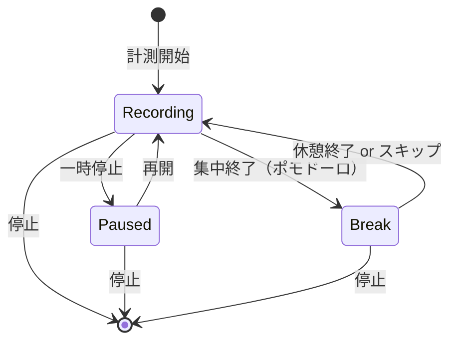

# 画面仕様書 - タイマー・集中モード

作成日：2026-01-21
分割日：2026-01-31
関連ドキュメント：00_common.md, implementation/03_timer.md, implementation/08_pomodoro.md

---

## 1. 概要

| 項目 | 内容 |
|------|------|
| 対象画面 | SCR-004 計測（タイマー）、SCR-005 集中モード |
| 目的 | 作業時間の計測機能と集中モードを提供する |
| 対応実装指示書 | implementation/03_timer.md, implementation/08_pomodoro.md |

---

## 2. 画面遷移（抜粋）

```
┌────────────────┐
│    SCR-002     │
│プロジェクト一覧 │
└───────┬────────┘
        │
        ▼
┌────────────┐
│  SCR-004   │
│計測(タイマー)│ ←── グローバルナビゲーションからも遷移可能
└─────┬──────┘
      │ 計測開始（自動遷移）
      ▼
┌────────────┐
│  SCR-005   │
│ 集中モード  │ ←── 計測中の専用画面
└────────────┘
```

---

## 3. 状態遷移図



---

## 4. SCR-004：計測（タイマー）

### 4.1 画面概要

| 項目 | 内容 |
|------|------|
| 画面ID | SCR-004 |
| 画面名 | 計測（タイマー） |
| 目的 | プロジェクトとポモドーロプリセットを選択し、計測を開始する |
| 認証要否 | 必要 |
| 遷移元 | グローバルナビゲーション、SCR-002 プロジェクト一覧 |
| 遷移先 | SCR-005 集中モード（計測開始時に自動遷移） |

### 4.2 画面レイアウト（概要）

```
┌─────────────────────────────────────────────────────┐
│ [グローバルナビゲーション]                           │
├─────────────────────────────────────────────────────┤
│                                                     │
│                     計測                            │
│                                                     │
│  プロジェクト選択 *                                 │
│  ┌─────────────────────────────────────────────┐   │
│  │ 🔵 プロジェクトA                        ▼   │   │
│  └─────────────────────────────────────────────┘   │
│                                                     │
│  ポモドーロプリセット（任意）                        │
│  ┌─────────────────────────────────────────────┐   │
│  │ デフォルト（25分/5分）                  ▼   │   │
│  └─────────────────────────────────────────────┘   │
│  [プリセット管理 →]                                 │
│                                                     │
│            ┌─────────────────────┐                 │
│            │                     │                 │
│            │    ▶ 計測開始       │                 │
│            │                     │                 │
│            └─────────────────────┘                 │
│                                                     │
├─────────────────────────────────────────────────────┤
│ [タブバー（スマホのみ）]                             │
└─────────────────────────────────────────────────────┘
```

### 4.3 UI要素一覧

| No | 要素ID | 要素種別 | 要素名 | 説明 | 必須 |
|:--:|--------|----------|--------|------|:----:|
| 1 | L004-01 | ドロップダウン | プロジェクト選択 | 計測対象のプロジェクトを選択 | ○ |
| 2 | L004-02 | ドロップダウン | プリセット選択 | ポモドーロプリセットを選択 | - |
| 3 | L004-03 | リンク | プリセット管理リンク | SCR-009へ遷移 | ○ |
| 4 | L004-04 | ボタン | 計測開始ボタン | 計測を開始し、SCR-005へ自動遷移 | ○ |

### 4.4 モーダル：計測中の別プロジェクト開始警告

```
┌─────────────────────────────────────┐
│ 計測中のプロジェクトがあります [×]   │
├─────────────────────────────────────┤
│                                     │
│  現在「プロジェクトA」を計測中です。 │
│  計測を終了して、新しいプロジェクト  │
│  の計測を開始しますか？              │
│                                     │
│  [キャンセル]  [計測を切り替える]    │
│                                     │
└─────────────────────────────────────┘
```

| No | 要素ID | 要素種別 | 要素名 | 説明 | 必須 |
|:--:|--------|----------|--------|------|:----:|
| 1 | M004-01 | テキスト | 警告メッセージ | 現在の計測状況を表示 | ○ |
| 2 | M004-02 | ボタン | キャンセルボタン | モーダルを閉じる | ○ |
| 3 | M004-03 | ボタン | 切替ボタン | 現在の計測を停止し、新しい計測を開始 | ○ |

### 4.5 機能仕様

| No | 機能 | トリガー | 処理内容 |
|:--:|------|----------|----------|
| 1 | プロジェクト選択 | ドロップダウン選択 | 計測対象プロジェクトを設定 |
| 2 | プリセット選択 | ドロップダウン選択 | ポモドーロプリセットを設定 |
| 3 | 計測開始 | 計測開始ボタン押下 | 計測を開始し、SCR-005へ自動遷移 |
| 4 | 計測切替警告 | 計測中に別プロジェクト開始時 | 2ステップ確認（警告→確定）を表示 |
| 5 | 計測切替実行 | 切替ボタン押下 | 現在の計測を停止し、新しい計測を開始 |

### 4.6 エラー・バリデーション

| No | 条件 | エラーメッセージ | 表示位置 |
|:--:|------|------------------|----------|
| 1 | プロジェクト未選択で開始 | 「プロジェクトを選択してください」 | L004-01の下 |
| 2 | 通信エラー | 「計測の開始に失敗しました。もう一度お試しください。」 | トースト |

### 4.7 レスポンシブ対応

| 項目 | PC | スマホ |
|------|-----|--------|
| レイアウト | 中央寄せ、最大幅500px | 全幅、パディング16px |
| 計測開始ボタン | 大きめ（高さ60px） | さらに大きめ（高さ80px）、タップしやすく |

---

## 5. SCR-005：集中モード

### 5.1 画面概要

| 項目 | 内容 |
|------|------|
| 画面ID | SCR-005 |
| 画面名 | 集中モード |
| 目的 | 計測中の没入を支援し、最小限のUIで集中を維持する |
| 認証要否 | 必要 |
| 遷移元 | SCR-004 計測（タイマー）から自動遷移 |
| 遷移先 | 任意の画面（離脱時確認後） |

### 5.2 画面レイアウト（記録中）

```
┌─────────────────────────────────────────────────────┐
│                                                     │
│  [← 戻る]                              [メモ 📝]   │
│                                                     │
│                                                     │
│                  🔵 プロジェクトA                  │
│                                                     │
│                      記録中                         │
│                                                     │
│                                                     │
│                    ┌─────────┐                     │
│                    │         │                     │
│                    │ 1:23:45 │                     │
│                    │         │                     │
│                    └─────────┘                     │
│                                                     │
│                                                     │
│       [⏸ 一時停止]              [⏹ 停止]         │
│                                                     │
│                                                     │
│  ─────────────────────────────────────────────     │
│  ポモドーロ: 集中 15:00 / 25:00                    │
│  ─────────────────────────────────────────────     │
│                                                     │
└─────────────────────────────────────────────────────┘
```

### 5.3 画面レイアウト（一時停止中）

```
┌─────────────────────────────────────────────────────┐
│                                                     │
│  [← 戻る]                              [メモ 📝]   │
│                                                     │
│                                                     │
│                  🔵 プロジェクトA                  │
│                                                     │
│                    一時停止中                       │
│                                                     │
│                                                     │
│                    ┌─────────┐                     │
│                    │         │                     │
│                    │ 1:23:45 │                     │
│                    │         │                     │
│                    └─────────┘                     │
│                                                     │
│                                                     │
│       [▶ 再開]                  [⏹ 停止]          │
│                                                     │
│                                                     │
└─────────────────────────────────────────────────────┘
```

### 5.4 画面レイアウト（ポモドーロ休憩中）

```
┌─────────────────────────────────────────────────────┐
│                                                     │
│  [← 戻る]                              [メモ 📝]   │
│                                                     │
│                                                     │
│                  🔵 プロジェクトA                  │
│                                                     │
│                     休憩中                          │
│                                                     │
│                                                     │
│                    ┌─────────┐                     │
│                    │         │                     │
│                    │  3:45   │                     │
│                    │         │                     │
│                    └─────────┘                     │
│                                                     │
│                                                     │
│       [⏭ スキップ]             [⏹ 停止]          │
│                                                     │
│                                                     │
│  ─────────────────────────────────────────────     │
│  休憩: 3:45 / 5:00                                 │
│  ─────────────────────────────────────────────     │
│                                                     │
└─────────────────────────────────────────────────────┘
```

### 5.5 UI要素一覧

| No | 要素ID | 要素種別 | 要素名 | 説明 | 必須 |
|:--:|--------|----------|--------|------|:----:|
| 1 | L005-01 | ボタン | 戻るボタン | 離脱確認ダイアログを表示 | ○ |
| 2 | L005-02 | ボタン | メモボタン | メモ入力オーバーレイを表示 | ○ |
| 3 | L005-03 | アイコン | プロジェクト色 | 計測中のプロジェクト色 | ○ |
| 4 | L005-04 | テキスト | プロジェクト名 | 計測中のプロジェクト名 | ○ |
| 5 | L005-05 | テキスト | 計測状態 | 「記録中」「一時停止中」「休憩中」 | ○ |
| 6 | L005-06 | テキスト | 経過時間 | 大きく視認性高く表示（HH:MM:SS） | ○ |
| 7 | L005-07 | ボタン | 一時停止ボタン | 計測を一時停止（記録中のみ表示） | ○ |
| 8 | L005-08 | ボタン | 再開ボタン | 計測を再開（一時停止中のみ表示） | ○ |
| 9 | L005-09 | ボタン | 停止ボタン | セッションを確定して終了 | ○ |
| 10 | L005-10 | ボタン | スキップボタン | 休憩をスキップ（休憩中のみ表示） | ○ |
| 11 | L005-11 | プログレスバー | ポモドーロ進捗 | 集中/休憩の進捗を表示 | - |
| 12 | L005-12 | テキスト | ポモドーロ時間 | 現在のフェーズと残り時間 | - |
| 13 | L005-13 | バナー | 通知バナー | ポモドーロ通知を表示（5秒で自動消去） | - |
| 14 | L005-14 | バナー | オフライン表示 | 通信断時に表示 | - |

### 5.6 オーバーレイ：メモ入力

```
┌─────────────────────────────────────┐
│ メモ                        [×]     │
├─────────────────────────────────────┤
│                                     │
│  ┌─────────────────────────────┐   │
│  │                             │   │
│  │ やったこと、詰まった点など   │   │
│  │                             │   │
│  │                             │   │
│  └─────────────────────────────┘   │
│                                     │
│  [キャンセル]        [保存]         │
│                                     │
└─────────────────────────────────────┘
```

| No | 要素ID | 要素種別 | 要素名 | 説明 | 必須 |
|:--:|--------|----------|--------|------|:----:|
| 1 | O005-01 | テキストエリア | メモ入力欄 | 自由記述 | - |
| 2 | O005-02 | ボタン | キャンセルボタン | オーバーレイを閉じる（入力破棄） | ○ |
| 3 | O005-03 | ボタン | 保存ボタン | メモを保存してオーバーレイを閉じる | ○ |

### 5.7 モーダル：離脱確認

```
┌─────────────────────────────────────┐
│ 計測中です                   [×]    │
├─────────────────────────────────────┤
│                                     │
│  計測中の画面から離れます。         │
│  どうしますか？                     │
│                                     │
│  [計測を継続して戻る]               │
│                                     │
│  [計測を停止して戻る]               │
│                                     │
└─────────────────────────────────────┘
```

| No | 要素ID | 要素種別 | 要素名 | 説明 | 必須 |
|:--:|--------|----------|--------|------|:----:|
| 1 | M005-01 | ボタン | 継続して戻るボタン | 計測を継続したまま前画面へ | ○ |
| 2 | M005-02 | ボタン | 停止して戻るボタン | 計測を停止して前画面へ | ○ |

### 5.8 機能仕様

| No | 機能 | トリガー | 処理内容 |
|:--:|------|----------|----------|
| 1 | 一時停止 | 一時停止ボタン押下 | 計測を一時停止（経過時間の加算を停止） |
| 2 | 再開 | 再開ボタン押下 | 一時停止中の計測を再開 |
| 3 | 停止 | 停止ボタン押下 | セッションを確定し、計測を終了 |
| 4 | 休憩スキップ | スキップボタン押下 | 休憩を終了し、次の集中フェーズを開始 |
| 5 | メモ入力 | メモボタン押下 | メモ入力オーバーレイを表示 |
| 6 | メモ保存 | 保存ボタン押下 | メモをセッションに保存 |
| 7 | 離脱確認 | 戻るボタン押下 | 離脱確認モーダルを表示 |
| 8 | 計測継続して戻る | 継続ボタン押下 | 計測を継続したまま前画面へ遷移 |
| 9 | 計測停止して戻る | 停止ボタン押下 | 計測を停止して前画面へ遷移 |
| 10 | ポモドーロ通知 | 集中/休憩終了時 | 通知バナーを表示（5秒後自動消去） |
| 11 | オフライン表示 | 通信断検知 | オフラインバナーを表示 |
| 12 | ブラウザクローズ時の計測終了 | ブラウザ/タブを閉じる | 最終アクティブ時刻を記録し、次回起動時にその時刻でセッションを確定（5.10参照） |

### 5.9 レスポンシブ対応

| 項目 | PC | スマホ |
|------|-----|--------|
| 経過時間フォントサイズ | 72px | 56px |
| 操作ボタンサイズ | 60px × 60px | 80px × 80px（タップしやすく） |
| レイアウト | 中央寄せ | 中央寄せ、縦方向に余白確保 |

### 5.10 ブラウザクローズ時の挙動

計測中にブラウザ（タブ）が閉じられた場合、閉じた時点で計測を終了しセッションを確定する。

#### 判定方式

ブラウザを閉じる際の処理では通信を伴う保存が完了する保証がないため、
「最終アクティブ時刻の記録」と「次回起動時の確定」の2段階で実現する。

| 段階 | タイミング | 処理内容 |
|:----:|------------|----------|
| 1 | 計測中（10秒間隔） | 最終アクティブ時刻をローカルに記録 |
| 2 | ページ非表示・破棄の直前 | 最終アクティブ時刻をローカルに記録（＝閉じた時刻） |
| 3 | アプリ起動時 | 計測中の状態が残っていれば、最終アクティブ時刻からの経過を判定 |

#### 起動時の判定基準

| 条件 | 判定 | 処理内容 |
|------|------|----------|
| 最終アクティブ時刻からの経過が120秒以内 | リロード等 | 計測をそのまま継続 |
| 最終アクティブ時刻からの経過が120秒超 | ブラウザクローズ | 最終アクティブ時刻を終了時刻としてセッションを確定し、タイマーとポモドーロをリセット。トーストで通知 |
| 確定した作業時間が0 | ブラウザクローズ | セッションは保存せずリセットのみ。トーストで通知 |

※ 閾値120秒は、バックグラウンドタブでの`setInterval`の間引き（最大1分間隔）を考慮した値。
※ 確定した作業時間には、ブラウザを閉じていた期間および一時停止していた期間は含まれない。
※ オフライン時はオフラインキューに追加され、オンライン復帰時に同期される。

